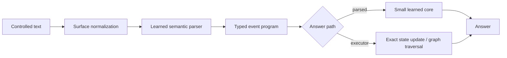

# Compact Semantic Reasoning

*Research concept and direction by Adam Barnett · September 15, 2026.*

**V1 Experimental** is a compact research system that translates controlled natural-language problems into typed events, then answers them with either a small learned reasoning core or an exact executor. The project studies a focused question: can explicit semantic structure improve accuracy and reasoning reliability when model size and local compute are limited?

The current answer is promising within a narrow domain. The system is very accurate on several synthetic accounting and ordering tasks, and the full text-to-program path is covered by 108 automated tests. It is not a general-purpose language model, a chatbot, or evidence of broad intelligence. One of three preservation screens still fails the hardest wording and combined-change program gates, and the reserved final evaluation remains unopened.

[Interactive project overview (open locally or serve with GitHub Pages)](README.html) · [Read the complete experiment history](docs/RESEARCH_HISTORY.md) · [Review the continuous-improvement design](docs/CONTINUOUS_IMPROVEMENT_V1_RESEARCH.md)

## What this project tests

The central experiment is an explicit separation of language interpretation from reasoning:



The parser reads visible words, first-mention entity identities, word order, and integer literals. It predicts rows with five fields:

```text
(event kind, entity A, entity B, numeric value, active/inactive)
```

Those rows represent initial balances, transfers, ordering facts, and two query types. The exact executor updates balances or follows ordering edges. The learned core provides a separately measurable neural reasoning path.

This design is called a semantic compiler in the research notes because it turns surface language into a constrained executable representation. It is not a conventional programming-language compiler, and it does not eliminate numerical computation. Words are assigned integer lookup IDs, learned embeddings are floating-point tensors, and quantities also use a scalar channel. The experiment preserves natural relationships through typed structure and role binding, rather than claiming that a neural model can train without numbers.

## Current V1 snapshot

| Property | Current value |
| --- | ---: |
| Status | Experimental research snapshot |
| Parser architecture | Lexical attachment parser |
| Parser parameters | 919,045 |
| Learned reasoning-core parameters | 346 |
| Combined parsed path | 919,391 |
| Vocabulary entries | 91 |
| Entity capacity | 4 per problem |
| Clause capacity | 24 per problem |
| Encoded positions | 160 per clause |
| Automated tests | 108 passing locally |
| Reserved final model evaluation | Not run |

The selected checkpoint is [`models/semantic_candidate.pt`](models/semantic_candidate.pt). It contains the parser and learned core and selects exact execution by default. [`models/semantic_model.pt`](models/semantic_model.pt) is the earlier incumbent retained because the experiment runner uses it as a fixed reference and reasoning-core source.

### What “100%” means here

The recorded 100% result applies to a bounded regression target: 400 routine development worlds per seed, split evenly between accounting and relation tasks, across three observed seeds. Complete programs and both answer paths were correct on those routine examples.

It does not mean 100% accuracy on arbitrary language. The strict preservation protocol also requires at least 99% on routine/retention slices and at least 95% on harder wording, number, length, composition, and combined slices. Seeds 419 and 383 passed the full observed development gates. Seed 433 retained correct routine answers but fell to 76% accounting program accuracy on unfamiliar wording and 38% on the combined accounting shift. Because the same development examples were reused across seeds and the reserved final was not scored, the checkpoint remains experimental.

This distinction is a major research result. An exact executor can return a correct answer even when an inactive transfer has the wrong internal roles, because that event does not change the balance. The project therefore gates complete event programs, role consistency, polarity contrasts, and answers instead of reporting answer accuracy alone.

## Quick start

Python 3.12 was used for the recorded local environment. A CPU is enough for inference and tests; training experiments can use CUDA when available.

### Windows PowerShell

```powershell
python -m venv .venv
.\.venv\Scripts\python.exe -m pip install -r requirements.txt
.\.venv\Scripts\python.exe scripts\semantic_model.py `
  --text "Alice starts with 8 coins. Bob starts with 3 coins. Alice gives Bob 3 coins. How many coins does Alice have now?" `
  --mode executor
```

### Linux or macOS

```bash
python3 -m venv .venv
.venv/bin/python -m pip install -r requirements.txt
.venv/bin/python scripts/semantic_model.py \
  --text "Alice starts with 8 coins. Bob starts with 3 coins. Alice gives Bob 3 coins. How many coins does Alice have now?" \
  --mode executor
```

Expected output:

```json
{"mode": "executor", "answer": "5", "scope": "Controlled-language research model, not unrestricted language understanding."}
```

The command uses the candidate checkpoint by default. Pass `--model models/semantic_model.pt` only when reproducing the earlier incumbent. Available inference modes depend on the checkpoint:

- `executor` parses text and executes the predicted typed program exactly.
- `parsed` parses text and sends the predicted program through the learned core.
- `raw`, `raw_aux`, and `hybrid` are historical comparison paths available only in checkpoints that contain those components.

## Run the checks

Run the complete semantic suite:

```powershell
.\.venv\Scripts\python.exe -B -m unittest discover -s scripts -p "test_semantic_v1.py" -v
```

On Linux or macOS, replace the executable with `.venv/bin/python`. The tests cover:

- deterministic task construction and disjoint split rules;
- surface-only parsing with no oracle-event leakage;
- entity, quantity, padding, and sentence-boundary invariants;
- parser losses, gradients, masks, and role-binding paths;
- exact execution and learned reasoning behavior;
- checkpoint validation and restoration;
- development-only selection, strict program gates, and final-set isolation;
- preservation controls and known regression cases.

The tests validate software contracts and fixed fixtures. They do not reproduce every historical training run or convert observed development results into unseen generalization evidence.

## Reproduce or extend experiments

The experiment runner contains the accumulated protocols used to develop the architecture:

```powershell
.\.venv\Scripts\python.exe scripts\semantic_experiment.py --help
```

Training protocols are intentionally explicit about seeds, data splits, selection, controls, and whether the reserved final may be touched. Read the CLI help and [`MASTER_PLAN.md`](MASTER_PLAN.md) before launching a fit. The current workspace preparation did not train a model or score the reserved final.

Detailed semantic records are consolidated in [`results/semantic_v1.json`](results/semantic_v1.json). That file is research evidence, not a leaderboard. It includes development results, controls, fingerprints, architecture decisions, failures, and artifact checks from multiple stages. Historical numbers predating the current reproducible core are summarized with evidence qualifications in [`docs/RESEARCH_HISTORY.md`](docs/RESEARCH_HISTORY.md).

## Repository layout

```text
.
├── .github/workflows/tests.yml
├── .gitattributes
├── .gitignore
├── README.md
├── README.html
├── MASTER_PLAN.md
├── MASTER_LOG.md
├── requirements.txt
├── docs/
│   ├── RESEARCH_HISTORY.md
│   └── CONTINUOUS_IMPROVEMENT_V1_RESEARCH.md
├── models/
│   ├── semantic_candidate.pt
│   └── semantic_model.pt
├── results/
│   └── semantic_v1.json
└── scripts/
    ├── semantic_model.py
    ├── semantic_tasks.py
    ├── semantic_experiment.py
    └── test_semantic_v1.py
```

Each retained file supports current inference, reproducibility, testing, accumulated evidence, or the next research decision. Superseded phase scripts, duplicate reports, corpora, packaging archives, and unrelated model branches have been removed from the release workspace.

## How the architecture evolved

The project began with the intuition that compact representations might let a small local model learn useful relationships from less text. Early experiments found high accuracy when language was deterministically converted into signed state changes or graph edges. Later tests showed why those results had to be interpreted carefully: much of the gain came from correct decomposition, identity binding, and exact execution, while some comparisons gave structured events directly to one model and raw text to another.

The research then moved through relational message passing, specialist composition, dynamic graphs, program execution, workflow prediction, long-stream processing, and learned text-to-structure parsing. Larger inputs and wider models did not improve quality consistently. A controlled deterministic parser produced excellent results on its supported grammar, while a learned byte-level parser generalized poorly. That contrast redirected the work toward the current interface: visible text in, typed events in the middle, and independently tested answer paths out.

The current lexical attachment parser was developed specifically to improve sentence structure, distant role binding, active/inactive transfers, and familiar-word paraphrases. Freezing most of a useful representation and updating 9,973 role-related parameters preserved routine behavior in all three screens, but one seed still failed hard program gates. The result is a credible Version 1 research baseline and a precise next problem, rather than a completed general language model.

The full chronology, including negative results and comparison caveats, is in the [research history](docs/RESEARCH_HISTORY.md).

## Scope and limitations

V1 supports controlled synthetic problems with one final question, one to four visible proper names, a fixed event schema, and short arithmetic or ordering chains. It does not currently provide:

- open-domain conversation or free-form text generation;
- broad factual knowledge;
- robust handling of arbitrary vocabulary or grammar;
- persistent memory between requests;
- online or continual weight updates;
- million-token active attention;
- proof of superior efficiency against modern language models;
- a scientifically qualified final result.

The small parameter count explains why this project can train locally, while the structured task explains its high precision. A 919K-parameter specialist can outperform a huge general model on a tightly defined operation without possessing the larger model’s knowledge, language coverage, or transfer ability. Scaling knowledge and language breadth will require additional data, capacity, and evaluation; it will not be solved by the current compiler alone.

## Next research direction

The proposed next version separates immediate knowledge updates from slower learned improvement:

1. Serve an immutable, versioned model so active conversations never see partially updated weights.
2. Admit new facts into a scoped, provenance-aware memory and make them retrievable without retraining.
3. Build verified replay examples from recurring interpretation failures.
4. Train a fixed-capacity candidate or bounded adapter in the background.
5. Publish it only after new-skill, retention, resource, and concurrency gates pass.
6. Consolidate or evict stored knowledge at device-specific limits instead of allowing uncontrolled growth.

Long-document access should initially use retrieval and verified structured scans over a large corpus, with a smaller measured active context. A million-token searchable library and a million-token neural attention window are different capabilities. The detailed design, risks, and proposed acceptance tests are documented in the [continuous-improvement architecture](docs/CONTINUOUS_IMPROVEMENT_V1_RESEARCH.md).

## Research standard

Results in this repository are labeled by what was actually measured. Development screens, exact regressions, historical reports, and unopened final evaluations are kept distinct. Comparisons must use the same raw inputs and count parser, model, and execution costs. Claims about a compiler, representation, or architecture require end-to-end controls; a correct answer is insufficient when the predicted program is wrong.

V1 Experimental is useful because it turns broad ambitions into testable interfaces and known failure modes. Its strongest contribution is the evidence that explicit semantics can make compact reasoning reliable inside a defined contract, while text-to-structure generalization remains the central bottleneck.
