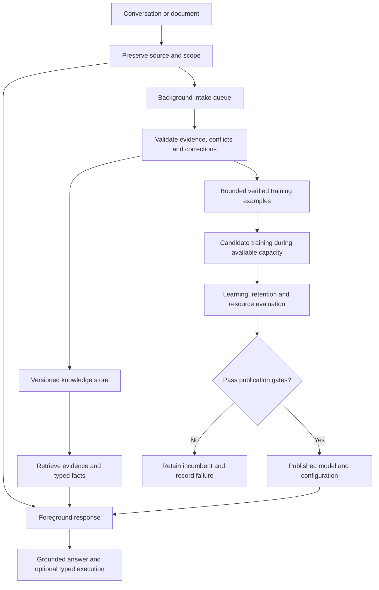

# Continuous Improvement V1 Architecture

*Research concept and direction by Adam Barnett · September 15, 2026.*

## Recommendation

Build a system that **updates its knowledge promptly, improves its learned behavior in the background, and publishes only evaluated model versions**. Keep the reasoning core stable, preserve source text alongside structured representations, and place explicit limits on memory, training, context and stored model versions. This is a practical next architecture for the research; it is not evidence that the present small model already has general conversational intelligence.

The recommended starting point is local-first, with cloud processing optional and disabled by default. Parameter count stays fixed initially. Knowledge storage may grow to a configured ceiling; afterward the system replaces, consolidates or evicts information within that ceiling. Increasing model size becomes a separately evaluated upgrade, rather than an automatic response to every new document.

The essential distinction is between four resources:

| Resource | What changes | Example | Main limitation |
| --- | --- | --- | --- |
| Persistent knowledge | Stored facts, documents, events and their indexes | Remember a corrected delivery address | Retrieval, provenance, privacy and storage capacity |
| Learned behavior | Existing weights or a bounded adapter | Understand a previously difficult sentence construction | Forgetting, label quality and training cost |
| Active context | Information available to one response | Read the relevant portions of a long conversation | Context quality, working memory and inference latency |
| Model capacity | Number of parameters or experts | Replace a small backbone with a larger one | Hardware cost and a new qualification cycle |

A fact can become usable without changing any weights. A fixed-size model can improve through training without growing. A large document collection can remain searchable without placing the entire collection into every prompt. These capabilities should have separate measurements and release claims.

## Existing foundation and earlier conclusions

The recorded earlier discussion concluded that continual improvement at fixed capacity is feasible through updates to existing weights or settings and bounded fact/replay memory. It also identified the need for verified feedback and retention tests. The proposed architecture preserves that conclusion while adding optional growth up to device-specific limits. Finite storage cannot retain an unlimited quantity of independent information exactly.[^1]

The release baseline is **V1 Experimental, 1.0.0-experimental**. Its semantic candidate has 919,045 parser parameters and a 346-parameter learned/fitted reasoning core. Its vocabulary contains 91 entries, and its supported schema covers four entities, at most 24 clauses, one signed integer per clause and short additive/ordering problems. It is a specialized text interpreter and reasoner, not a general chat model.[^2]

The strongest recent improvement came from preserving the encoder and kind/activity heads after update 300, then training only 9,973 existing role parameters. Routine development programs and answers reached 100% in all three observed screens. However, only two seeds passed all gates; the third achieved 76% wording and 38% combined-change accounting program accuracy despite correct base answers. The same development examples were reused across seeds. The reserved final remains unscored, and a release label does not confer scientific promotion.[^1]

This is directly relevant to continual learning: protecting useful components can help, but freezing an encoder does not guarantee that remaining heads can recover every missing distinction. Correct final answers can conceal incorrect internal programs, particularly for inactive transfers. Retention evaluation must therefore include complete programs and role/polarity behavior, not only answer accuracy.

Historical compiler gains support **explicit structure and faithful decomposition**. The recorded Phase 13 comparison moved from 36.52% exact parsing with a learned byte-CNN to 100% with a controlled-language compiler on supported paraphrases; answers rose from 51.28% to 99.13%. Some other historical comparisons supplied correct event tuples directly to the compact model, bypassing text interpretation. These results support carefully defined interfaces, not unrestricted language understanding or a universal compression advantage.[^1]

The reusable pieces are the typed event schema, source-aware preprocessing, numerical channel, reasoning/execution separation, frozen-component experiments, complete-program tests, checkpoint loading and artifact hashes. The missing pieces are substantial: persistent knowledge, scoped identities, evidence validation, replay management, resumable training, concurrent serving, model publication/rollback, resource scheduling and conversational memory. Current latent trigger positions are not verified grammatical explanations or raw-source provenance; normalized token offsets need a separate mapping to original spans. Current balances/graph state reset for each request.

The semantic model predicts a limited event schema and does not generate open-ended conversation. For an eventual general assistant, evaluate a suitable pretrained language backbone separately and connect it to the specialist. The first continual-learning experiments can use the specialist without pretending that this integration already exists.[^2]

## Proposed system

The foreground answers using one published model bundle and one consistent evidence revision. The background process collects new information, makes appropriate facts retrievable, and prepares candidate training data. Training and publication are separate operations: a completed training job does not automatically become the serving model.

The specialist remains useful where its schema applies. A future general language component handles broader interpretation and expression, while supported arithmetic and graph operations use explicit execution or the separately measured learned core. Unsupported information stays available as source text. It must not be forced into an accounting event merely because that is the current schema.

Retrieval-augmented generation provides an established basis for separating parameter knowledge from an external document index. The original RAG work demonstrated useful combinations of learned generation and retrieved evidence, including benefits on knowledge-intensive tasks. This motivates the separation here; it does not establish that a retriever will always find the right passage or that a generator will use it correctly.[^3]

### Knowledge representation

Keep three linked forms of retained information: original source chunks, explicit facts/events where the semantics are supported, and search representations. Dense vectors are useful for finding related language; exact text, identifiers, dates, numbers, negation and provenance remain independently accessible. A vector alone is not a trustworthy record of a precise fact.

Each knowledge item should identify its source and exact span, owner/project scope, observation time, effective time, revision, status and links to superseded or conflicting statements. For example, a document received today may describe a policy that took effect last month. Both times matter. A correction should supersede the current claim while preserving bounded historical evidence for questions about the past.

Current entity IDs such as `e0` are local to a prompt. Persistent memory needs stable scoped identifiers and an explicit mapping into the specialist's local slots. Two documents mentioning “Alice” must not automatically become one person, and the first entity in every document must not become the same persistent entity. Global storage may contain many entities, but a query exceeding the specialist's four-entity interface still needs another execution path or a validated decomposition.

Indexing should combine exact/lexical search with semantic retrieval, plus explicit entity and time filters. Publication must keep source records and search-index revisions compatible. Initially, newly committed text can use lexical retrieval while its vector is pending; that partial indexing state must be measurable. Replacing an embedding model requires versioned reindexing or a deliberate migration, because vectors from unrelated embedding spaces are not interchangeable.

Hierarchical memory is useful for long conversations: retain recent turns, compact episode summaries, important scoped facts and retrievable original passages. MemGPT demonstrates the value of moving information between memory tiers around a limited context window. Its virtual-context approach should not be interpreted as lossless attention over unlimited text.[^4]

### Information admission and correction

Information received during a conversation is not automatically a verified training target. Separate user preferences, user-reported facts, authoritative documents, inferred claims, hypothetical scenarios and model-generated text. A statement inside a hypothetical problem belongs to that problem's world unless explicitly made persistent. Retrieved documents supply evidence; they do not gain authority to change application instructions or training policy.

A simple example illustrates the two update speeds. If a person explicitly changes their preferred measurement units, update scoped settings and use them on subsequent turns. If an approved project document changes a supported procedure, publish its revision in knowledge memory. If many verified examples show that the parser mishandles a sentence structure, queue those examples for a candidate training cycle. These are different operations even when all three feel like “learning” to the person using the assistant.

Automatically accept updates only under a defined admission policy, such as explicit first-person preferences within that person's scope or verified imports from an approved source. Conflicts and unsupported claims remain attributed or unresolved; recency alone is not proof. Repeated copies of one source are not independent corroboration. Confidence must be calibrated against labeled outcomes, rather than inferred from a model's confident wording.

For specialist skill training, require audited complete event/program targets, with source and role grounding where applicable. A correct answer, a thumbs-up or a complaint alone is insufficient supervision for the parser. Feedback without a validated target can prioritize investigation without becoming a training example.

This requirement is operationally important. PoisonedRAG demonstrates that malicious additions to a retrieval database can steer answers, even without changing model weights. Source tracking and quarantine are recommended defenses to evaluate, not a claim that this attack class has been solved.[^5]

Deletion must cover the source, derived facts, vectors, summaries and replay examples. If a deleted item already influenced an adapter, deleting its database row does not erase its effect from weights. Keep lineage sufficient to discard and retrain affected bounded adapters from a clean base, or report that exact removal has not been established. Frequently changing or private facts are therefore better kept out of weight training initially.

## Background learning without interrupting conversations

### Publication contract

Use immutable serving bundles. A request captures a model hash, tokenizer/encoder version, adapter version, schema/executor version, configuration version and evidence revision before inference. None changes during that response. Candidate training operates on different tensors and storage, never on the model object serving that response.

The candidate moves through a small lifecycle: queued, training, evaluated, publishable, active or rejected. Publication first checks artifact integrity and compatibility, loads and warms the candidate if memory permits, then changes the reference used by new requests. Existing requests finish with their original version. Rollback restores the previous reference; it does not reverse partially applied updates to a live tensor.

Pin versions for a response, not indefinitely for every historical conversation. Otherwise old sessions can retain unlimited model copies. At a later turn, a conversation may adopt a new approved version without losing its transcript. Any key/value cache created under incompatible model, adapter or tokenizer settings must be discarded or recomputed. A cached prefix is reusable only when its generating state is compatible.

For a larger backbone, separate request-bound adapters may share a read-only base if the serving runtime supports that contract. An in-place adapter replacement is safe only after all affected inference has stopped using it. PEFT exposes adapter hotswapping, and vLLM documents per-request adapters and dynamic loading; those features are implementation options, not substitutes for concurrency and cache-consistency tests. Keep model-management access internal to the trusted update service.[^6][^7]

Retain at most one active, one candidate and one rollback artifact by default, with all copies counted against storage and memory budgets. At promotion, the old active version becomes the rollback version. A new candidate should wait until prior in-flight references have drained and space is available. A long response may delay publication; it must not be terminated merely to install an improvement.

The same reference-counting rule applies to retiring search-index revisions. A second promotion or index rebuild must wait if it would exceed the cap while an older request still holds a revision. The immutable research reference is separate from these runtime slots and still counts toward total disk use.

### Scheduling and latency

On a shared GPU, simultaneous inference and training compete for memory bandwidth, compute and memory. Putting training in a background thread cannot guarantee zero slowdown. Start with **idle-time training**, small resumable jobs and foreground priority. Stop launching new training work when requests arrive, and pause at a safe training boundary; already-running kernels may still add delay.

For the current tiny specialist, a separately measured CPU learner may be practical while the GPU serves responses. A future multi-billion-parameter backbone is a different workload. If there is insufficient room to prepare and warm a replacement safely, defer publication to an idle interval. A dedicated second device or optional remote learner can reduce contention, but is not required for the first experiment.

There is a real tradeoff under continuous heavy use: strict foreground priority can starve training. The architecture should expose update age and queue depth, not claim a guaranteed learning deadline that the hardware cannot support. Background knowledge indexing can continue under its own CPU/I/O budget, and current-turn information remains available in the conversation while persistent processing catches up.

### Local storage and resumable training

A small implementation can use one local SQLite database for scoped knowledge, revisions, the update queue and compact run metadata, with bounded source/index files alongside it. WAL mode permits concurrent readers and a writer through snapshot isolation. Keep read transactions short: capture the evidence needed for a response, then release the transaction rather than holding it for an entire conversation.[^8][^9]

The current Python runtime embeds SQLite 3.49.1. Before implementing concurrent WAL storage, use a maintained runtime containing the WAL-reset fix; SQLite documents the fix in 3.51.3 and selected backports. The live database should reside on local application storage rather than be synchronized as an open database inside a cloud-synced research folder. Export consistent snapshots when needed. No dependency change is part of this architecture report.[^8]

Training checkpoints need more than inference weights: optimizer and scheduler state, random-number state, stream cursor, replay selection, trainable/frozen parameter policy, base-model hash, dataset lineage and evaluation version. The existing inference checkpoint should remain compatible and separate. Restart tests must demonstrate that a paused update neither skips nor duplicates examples and does not silently unfreeze the protected core.

## Fixed-capacity adaptation

The first learning experiment should reuse the current role-head update path and keep the reasoning core fixed. Freeze protected parameters from the first continual update; do not repeat the original 300-step unfrozen prefix in every cycle. Start from the experimental inference weights with a declared fresh optimizer, then save the full training state for subsequent resumptions. Compare role-only learning with one tightly bounded encoder-adaptation arm, because the failed third seed shows why head-only learning cannot be assumed sufficient.

Within that comparison, use the same replay mix, new-data exposure and declared update budget, while reporting actual compute. Neither role tuning nor encoder/adaptor tuning can recover word distinctions already collapsed to a single UNK input. Keep the first skill stream within the frozen 91-word vocabulary and existing event schema. A byte/subword fallback, vocabulary migration or new operation needs a separately qualified interface change.

For a future pretrained conversational backbone, fixed-rank LoRA is an appropriate candidate: it trains a small set of low-rank matrices while retaining the base weights. QLoRA further reduces base-weight storage during adaptation by using a frozen quantized model. Neither method guarantees retention, eliminates activation/optimizer costs, or proves that the resulting model can fit simultaneous training and long-context serving on this workstation.[^10][^11]

Replay mixes verified old examples with new examples to limit forgetting. Published continual-pretraining experiments show that replay and learning-rate scheduling can work well at substantial model scales, but their data transitions and training budgets differ from this project. That study primarily examined two-task transitions and did not replicate across multiple seeds. Replay fraction, learning rate and update cadence remain experimental choices; a published percentage is not a universal setting.[^12]

Maintain a fixed replay budget by bytes or tokens, not just number of rows. Preserve coverage of old operations, rare role/polarity cases and recent verified changes. Protected training anchors occupy a fixed quota inside the cap, with a predeclared replacement rule; a growing anchor for every failure would defeat the limit. Remove superseded current-fact targets from replay or explicitly frame them as historical facts. Keep training replay separate from validation and final evaluation: known evaluation failures can guide hypotheses but their labels must not quietly enter training. Use fresh examples of the relevant phenomenon.

A fixed adapter slot can be replaced repeatedly without growing the deployed model. An adapter per document, conversation or update would create a growing system even if each adapter were small. Distillation transfers teacher behavior into another model; applying it to periodic fixed-capacity consolidation is a proposed option that may lose rare behavior and must pass the same tests. It cannot create trustworthy new knowledge from an unverified teacher answer.[^16]

Regularization that discourages changes to important weights, such as elastic weight consolidation, is a later comparator if replay alone is insufficient. Its parameter-importance estimates also consume storage and embody assumptions about past tasks. It should earn its complexity through measured retention gains.[^13]

Do not start with gradients on every incoming message or autonomous rewriting of the training code. Weight updates need usable objectives and trustworthy signals; new text alone does not specify a correct answer or prove a new skill. Titans is a relevant research alternative: it updates an associative neural-memory module at inference time, with mechanisms for surprise and forgetting. Learning an association from context does not establish its truth. Initially compare such a module as isolated context memory, separately from persistent skill updates.[^17]

## Growth limits and device profiles

Capacity must be a vector of limits, not a single “maximum model size” setting. Account for base weights, trainable parameters, optimizer state, activation workspace, key/value cache, concurrent requests, source storage, vectors, replay, queued work and retained versions. Candidate preparation and index rebuilding also need temporary headroom within those limits.

| Profile | Initial serving policy | Learning policy | Behavior at capacity |
| --- | --- | --- | --- |
| Small computer or CPU-only | Small tested model, short measured context, retrieval from local storage | Knowledge updates; small head training only if latency permits | Fixed weights/adapter slots; bounded memory replacement; defer heavier learning |
| Current RTX 3090, 24 GiB VRAM, 64 GiB RAM | Specialist now; later benchmark a quantized conversational backbone independently | Idle-time candidate training and strict VRAM admission | Freeze parameter growth; consolidate or replace only after evaluation |
| Larger workstation or optional server | More context/concurrency after measurement | Separate training resources where available | Grow only within explicit budgets and after passing qualification |

These are policies, not measured fit guarantees or model purchases. Start a future conversational model at a supported 4K–8K context and expand only after memory and task-quality measurements. The current specialist's clause limits are a different interface and cannot be relabeled as an 8K conversational context.

When storage fills, deduplicate repeated evidence, retire superseded low-value items, bound historical versions and compact indexes. Protect explicitly pinned records and representative rare skills. If everything remaining is protected, stop accepting persistent additions rather than silently deleting protected knowledge. Continued fixed-size improvement is possible, but neither perpetual improvement nor zero forgetting is guaranteed.

If more hardware becomes available, increasing parameter count should remain an explicit migration experiment: choose a larger candidate, transfer useful behavior through training or distillation, and compare quality per unit of memory and latency. Adding experts also adds routing and storage costs. Automatic structural growth is a later research question, not necessary for continuous improvement V1.

## Million-token context

A million-token context window concerns how many tokens a model can use within an inference request; model-specific limits determine how input and generated tokens share that budget. It is distinct from a million-token searchable library, a million-token output allowance or permanent learning. A system can maintain a much larger library than its active context by retrieving relevant excerpts; that does not mean every token in the library participates in attention for every answer.

For a concrete documented example, Google's Gemini 2.5 Pro page lists an input limit of 1,048,576 tokens. This is a hosted-model capacity specification, not evidence that a local small model can match its implementation or accuracy. A model's supported window must be distinguished from the length at which it reliably solves the intended tasks.[^18]

For ordinary decoder attention, the key/value cache stores previous layer states so generation need not recompute the entire prefix at every step. Cache offloading trades GPU memory for host memory and data movement; cache quantization has its own quality and performance tradeoffs. For a homogeneous full-attention model, a useful estimate is:[^19]

`KV bytes = 2 × layers × cached tokens × KV heads × head dimension × bytes per element × concurrent sequences`

The factor of two represents keys and values. This excludes model weights, quantization metadata, activation/workspace memory and allocator overhead. Grouped-query attention reduces the number of KV heads; sliding-window or recurrent models have different storage behavior. Reducing KV heads is a trained architecture change, not a free inference switch. The formula must be applied to an actual model configuration rather than inferred from parameter count alone.[^20]

For an illustrative model with 32 layers, 8 KV heads, 128 dimensions per head and 16-bit cached elements, one sequence uses 128 KiB of cache per token. These dimensions match the 8B architecture in Meta's Llama 3 report; the million-token extension below is hypothetical and is not its documented context support.[^21]

| Cached tokens | Approximate KV cache only |
| ---: | ---: |
| 4,096 | 0.5 GiB |
| 8,192 | 1 GiB |
| 32,768 | 4 GiB |
| 131,072 | 16 GiB |
| 1,000,000 | 122.07 GiB |

These calculated figures are illustrative, not measurements of V1 or a particular commercial model. Ideal 8-bit KV storage halves the raw figures, before scales and workspace; it does not guarantee equivalent accuracy or speed. Under these assumptions, one million tokens cannot fit in the RTX 3090's 24 GiB VRAM, and the 16-bit cache alone exceeds the machine's 64 GiB system RAM.

Long-context systems combine suitable training and position handling with efficient attention kernels, cache management, reduced KV storage and sometimes distributed computation or selective attention. FlashAttention avoids materializing the full attention matrix and reduces memory traffic, but exact dense attention still performs work quadratic in input length during prefill. Scaling from 32,768 to 1,000,000 positions increases the attention-pair count by about 931 times under the same dense-attention assumptions; this is not a prediction of end-to-end runtime.[^22]

Position Interpolation is one published approach to extending a pretrained model's position range with additional adaptation. Merely increasing a maximum-length setting does not establish reliable long-range behavior. Meta also reports that short-context-only supervised fine-tuning degraded previously acquired long-context abilities; future continual-update retention tests must therefore include long-context tasks.[^23][^21]

Two other architecture families merit later comparisons. Longformer uses sparse local/global attention to reduce scaling costs; which connections remain visible becomes part of the design. Mamba uses selective state-space recurrence with linear sequence scaling; a fixed state compresses history and cannot preserve every arbitrary detail indefinitely. Neither should replace retrieval or exact source retention before it demonstrates a better tradeoff on the intended tasks.[^24][^25]

The best first local target is **reliable access to a million-token corpus through retrieval and structured memory**, with a smaller measured active window. For a question requiring every transaction, use a verified structured scan or explicit document traversal, not only top-k similarity retrieval. For open-ended cross-document reasoning, retrieval omissions and lossy summaries remain failure modes and must be measured.

Historical streaming experiments provide another caution: the V12 recurrent model executed 640-event inputs at fixed parameter count, but reported balanced accuracy fell to roughly 42–47%. Accepting a longer input is not the same as reasoning accurately across it.[^1]

## Research sequence and acceptance

The shortest useful sequence separates infrastructure correctness, knowledge updates and learned improvement. It avoids changing the language encoder, memory system, training method and context mechanism simultaneously.

| Stage | Experiment | Primary decision |
| --- | --- | --- |
| 1. Stable service | Serve the frozen specialist through a request/version boundary; inject candidate failures and restarts | Can updates remain isolated and recoverable? |
| 2. Knowledge updates | Compare no memory, lexical/source memory, then hybrid retrieval plus typed facts on a chronological update stream | Does new knowledge become usable accurately within bounded storage? |
| 3. Continual skills | Compare static weights, new-data-only tuning, replay with role-only tuning, then one bounded encoder-adaptation arm | Can behavior improve while retaining old complete programs? |
| 4. Conversation and long memory | Evaluate a separately chosen conversational backbone with the same memory service | Does the system work beyond the specialist's schema? |
| 5. Context and scale | Compare short context plus retrieval, longer supported context, and structured scans | Which method gives the best accuracy/latency/memory tradeoff? |

For the first chronological stream, use synthetic updates whose truth is independently known. Start with supported accounting/ordering worlds and separately tested settings APIs; new facts, corrections, retractions, repeated information, conflicting sources and preferences can test the memory service directly before a conversational component interprets them. This does not assume the current specialist understands temporal corrections or preferences in free text.

Split by source world, sentence family and time, keeping all paraphrase and counterfactual descendants with their originating world. Gate retrieval and training by when information became available. Evaluate a request before learning from its later verified label, then test unseen same-phenomenon worlds after adaptation; repeating the corrected item is a separate memorization score. Maintain both current-truth questions and explicitly historical questions so intended correction is not mistaken for forgetting.

Give all learning arms access to the same new-data pool and report actual new/replay tokens, updates, training time and annotation/retrieval costs. For the primary replay-versus-no-replay comparison, fix the total training-token/update budget: replay replaces some new-data exposure. A secondary equal-new-exposure comparison is possible, but its replay arm costs extra compute. Do not claim both equalities simultaneously. Include a static baseline, memory-only baseline and new-data-only fine-tuning diagnostic; vary actual adaptation seeds as well as stream order across at least three declared runs. Report per-seed and worst-slice results. Repeated queries to the same world are correlated observations, not independent evidence of generalization.

The existing 99% routine/retention and 95% harder-shift gates remain relevant within their original task scope, alongside 100% known-regression requirements. They do not become a universal target for all conversational questions. Preserve the unused confirmation seeds and reserved final from the earlier protocol; design separate disjoint continual-learning streams rather than consuming that final set as replay or development data.

For broader language tasks, predeclare accuracy, groundedness, abstention and coverage targets after establishing a baseline and auditing labels. Raising abstention can raise answered-question accuracy while reducing usefulness; always report both. The first objective is a measured improvement over the same static system under a fixed resource budget, not a claim of 100% intelligence.

### Measurements and provisional gates

| Area | Required measurements | Proposed acceptance rule |
| --- | --- | --- |
| Service consistency | Version IDs per response, cache compatibility, two promotions while an old request runs, index replacement, restart and rollback | Zero mixed-version responses, cap violations or corrupted publications in the fault-injection suite |
| Learning | New-task complete programs/answers; gain over static and memory-only controls | Gain on unseen new examples, not just memorized corrections |
| Retention | Old-task accuracy by operation/wording; maximum drop; backward transfer | Preserve existing strict specialist gates; declare any broader-task non-inferiority margin before tuning |
| Knowledge | Retrieval recall, source precision, current/historical truth, correction latency, abstention | Exact behavior on deterministic fixtures; separately report noisy real-document performance |
| Latency | Time to first response/token, inter-token delay, throughput, p50/p95/p99 | Initial target: no more than 10% p95 foreground degradation at a fixed workload; otherwise defer training |
| Resources | Peak CPU RAM/VRAM, disk including source/index/replay/versions, queue size | No limit violations under capacity pressure and interrupted writes |
| Isolation/deletion | Scope leakage, stale revisions, excluded-source reuse, derived-item removal | Zero observed violations on the declared deterministic suite |

These are proposed test criteria, not results already obtained. A zero-failure suite does not prove failure is impossible. Measure knowledge-publication delay separately from weight-publication delay; the latter may be unbounded while a small device remains continuously busy. Do not hide this by dropping queued work or silently training on incomplete data.

LongMemEval is a suitable external memory test because it covers extraction, multi-session reasoning, temporal reasoning, knowledge updates and abstention. Pin the dataset revision and audit an evaluation sample rather than mixing variants or relying only on an automated judge. A later, harder option is EverMemBench's multi-party, evolving conversation corpus exceeding one million tokens; its published results emphasize attribution and temporal-version problems that simple retrieval can miss.[^14][^15]

For active-context evaluation, use position sweeps with evidence near the beginning, middle and end; multiple relevant facts; multi-hop dependencies; aggregation; distractors; contradictions; and questions with no supported answer. Lost in the Middle motivates checking evidence position, while RULER expands evaluation beyond finding one hidden fact. Their results concern the models evaluated in those studies, not a universal score for current models. Recheck these abilities after each later learning cycle.[^26][^27]

## Implementation boundaries and remaining decisions

Keep `models/semantic_candidate.pt` frozen as the experimental reference. Runtime publication slots must not overwrite it or the older incumbent. Future implementation can add one cohesive runtime module and one continual-research runner under `scripts/`, extending the existing shared tests where appropriate. Store one bounded runtime database in local application data, keep separately named runtime model slots under the existing model location when suitable, and summarize research outcomes in the existing results structure and two master notes. Do not add a new log file for every update.

The first runtime should wrap the current inference API with `models/semantic_candidate.pt` and explicit `executor` or `parsed` mode, preserving complete-program diagnostics. The CLI now selects this experimental candidate by default; the older incumbent remains an explicit research reference. Expose ingestion, scoped retrieval, versioned prediction, candidate evaluation and publication as distinct operations. Public prediction must not gain access to gold events or future labels. An API response should distinguish evidence admitted, evidence indexed and model update applied, so “learned” does not ambiguously describe three different states.

The largest unresolved scientific issue is whether a bounded adaptation method can acquire new interpretation behavior across a long sequence of updates without eroding rare old behavior. The largest engineering issue is keeping model, cache, source and index revisions consistent under concurrent requests and fixed memory. The largest product gap is the absence of a qualified general conversational backbone.

The alternatives have different costs: memory-only updates are easy to inspect and reverse but cannot by themselves fix an interpretation skill; weight updates can generalize across new examples but are harder to attribute and undo; larger active context exposes more original evidence but costs working memory and processing time; recurrent or summarized memory is compact but loses detail. The recommended hybrid deliberately assigns each job to the component where it can be measured most directly.

Continuous Improvement V1 should therefore first demonstrate **useful new knowledge, retained old skills, uninterrupted responses and bounded resources** in a defined domain. Once that is measured, broader language training and larger context can be added with clear evidence about which component creates each improvement.

## Sources

[^1]: Text Vector Model project. [Research history](RESEARCH_HISTORY.md), [MASTER_LOG.md](../MASTER_LOG.md), and [semantic results](../results/semantic_v1.json). Local research record, reviewed September 15, 2026. Historical imported scores are reported results, not newly reproduced experiments.
[^2]: Text Vector Model project. [MASTER_PLAN.md](../MASTER_PLAN.md), [semantic_model.py](../scripts/semantic_model.py), [semantic_experiment.py](../scripts/semantic_experiment.py), and [semantic candidate](../models/semantic_candidate.pt). Local source/artifact evidence, September 15, 2026.
[^3]: Patrick Lewis et al. [Retrieval-Augmented Generation for Knowledge-Intensive NLP Tasks](https://arxiv.org/abs/2005.11401). NeurIPS 2020; revised April 12, 2021.
[^4]: Charles Packer et al. [MemGPT: Towards LLMs as Operating Systems](https://arxiv.org/abs/2310.08560). October 12, 2023; revised February 12, 2024.
[^5]: Wei Zou et al. [PoisonedRAG: Knowledge Corruption Attacks to Retrieval-Augmented Generation of Large Language Models](https://www.usenix.org/conference/usenixsecurity25/presentation/zou-poisonedrag). USENIX Security, August 2025.
[^6]: Hugging Face. [Hotswapping adapters](https://huggingface.co/docs/peft/main/en/package_reference/hotswap). PEFT main-branch documentation, accessed September 14, 2026; implementation must pin and verify a supported release.
[^7]: vLLM contributors. [LoRA Adapters](https://docs.vllm.ai/en/latest/features/lora/). Rolling documentation, accessed September 14, 2026; describes request-specific adapters and trusted runtime management.
[^8]: SQLite developers. [Write-Ahead Logging](https://www.sqlite.org/wal.html). Updated August 25, 2026; includes WAL-reset correction and concurrency limitations.
[^9]: SQLite developers. [Isolation In SQLite](https://www.sqlite.org/isolation.html). Documentation accessed September 14, 2026.
[^10]: Edward J. Hu et al. [LoRA: Low-Rank Adaptation of Large Language Models](https://arxiv.org/abs/2106.09685). June 17, 2021; revised October 16, 2021.
[^11]: Tim Dettmers et al. [QLoRA: Efficient Finetuning of Quantized LLMs](https://arxiv.org/abs/2305.14314). May 23, 2023.
[^12]: Adam Ibrahim et al. [Simple and Scalable Strategies to Continually Pre-train Large Language Models](https://arxiv.org/abs/2403.08763). March 13, 2024; revised September 4, 2024.
[^13]: James Kirkpatrick et al. [Overcoming catastrophic forgetting in neural networks](https://arxiv.org/abs/1612.00796). December 2, 2016; PNAS 2017.
[^14]: Di Wu et al. [LongMemEval: Benchmarking Chat Assistants on Long-Term Interactive Memory](https://arxiv.org/abs/2410.10813). October 14, 2024; revised March 4, 2025; ICLR 2025. [Official benchmark repository](https://github.com/xiaowu0162/LongMemEval), accessed September 14, 2026.
[^15]: Chuanrui Hu et al. [Evaluating Long-Horizon Memory for Multi-Party Collaborative Dialogues](https://arxiv.org/abs/2602.01313v3). March 11, 2026 revision of the EverMemBench preprint. The original February title and question count were superseded.
[^16]: Geoffrey Hinton, Oriol Vinyals and Jeff Dean. [Distilling the Knowledge in a Neural Network](https://arxiv.org/abs/1503.02531). March 9, 2015.
[^17]: Ali Behrouz, Peilin Zhong and Vahab Mirrokni. [Titans: Learning to Memorize at Test Time](https://arxiv.org/abs/2501.00663). First submitted December 31, 2024.
[^18]: Google. [Gemini 2.5 Pro](https://ai.google.dev/gemini-api/docs/models/gemini-2.5-pro). Official model documentation, accessed September 14, 2026.
[^19]: Hugging Face. [Cache strategies](https://huggingface.co/docs/transformers/kv_cache). Transformers documentation, accessed September 14, 2026.
[^20]: Joshua Ainslie et al. [GQA: Training Generalized Multi-Query Transformer Models from Multi-Head Checkpoints](https://arxiv.org/abs/2305.13245). May 22, 2023.
[^21]: Llama Team, Meta. [The Llama 3 Herd of Models](https://arxiv.org/html/2407.21783v3). July 2024; version 3 dated November 23, 2024. Table 3 supplies the illustrative architecture; section 4.3.4 discusses long-context post-training retention.
[^22]: Tri Dao et al. [FlashAttention: Fast and Memory-Efficient Exact Attention with IO-Awareness](https://arxiv.org/html/2205.14135v2). First submitted May 27, 2022. Theorem 1 states the dense-attention computation complexity.
[^23]: Shouyuan Chen et al. [Extending Context Window of Large Language Models via Positional Interpolation](https://arxiv.org/abs/2306.15595). June 27, 2023.
[^24]: Iz Beltagy, Matthew E. Peters and Arman Cohan. [Longformer: The Long-Document Transformer](https://arxiv.org/abs/2004.05150). April 10, 2020.
[^25]: Albert Gu and Tri Dao. [Mamba: Linear-Time Sequence Modeling with Selective State Spaces](https://arxiv.org/abs/2312.00752). December 1, 2023.
[^26]: Nelson F. Liu et al. [Lost in the Middle: How Language Models Use Long Contexts](https://arxiv.org/abs/2307.03172). July 6, 2023; TACL 2024.
[^27]: Cheng-Ping Hsieh et al. [RULER: What's the Real Context Size of Your Long-Context Language Models?](https://arxiv.org/abs/2404.06654). April 9, 2024.
