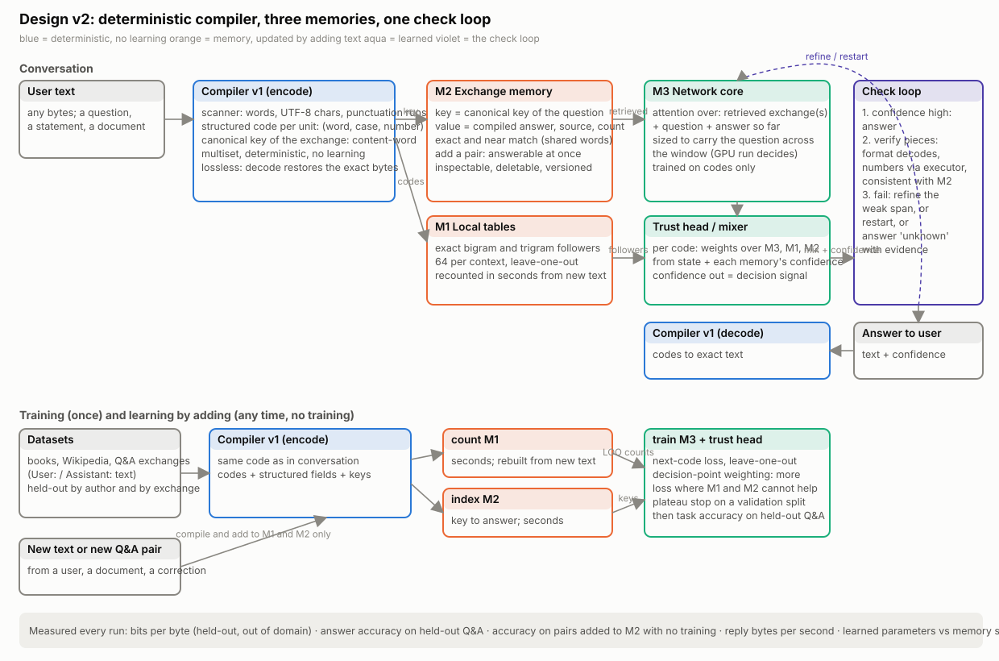

# Design v2: what the first phase taught us, and the architecture it points to

*9 October 2026. Research concept and direction by Adam Barnett. The diagram is
`figures/design_v2_flow.svg`.*

## 1. Straight answers first

**Why could we not train a model on encoded text, as the initial plan said?** We did, and it
worked. Every model in this research was trained on codes from the compiler and nothing else:
the network never saw a letter. The same compiler turned the training set into codes, turned
each user prompt into codes, and turned the model's codes back into text. That loop is built,
tested, and used in every run, including the question-and-answer test. The encoder idea did
not fail. What failed was an expectation attached to it: that compiling text would, by itself,
make the model learn with "a much smaller requirement". Measured against a conventional
tokenizer with the same network, compiled text was 1% better. Here is why, and it is the
single most important lesson of the phase.

**A lossless encoder cannot add knowledge.** The compiler is a bijection: the codes carry
exactly the information of the text, no more and no less, because they decode to the exact
bytes. A model's job is to predict that information, and the total surprise in a book is a
property of the book, not of its spelling. What an encoder *can* change is three things:
how many steps it takes to read the text (speed), whether the same thing always looks the
same (stability), and what structure is exposed for free (knowledge the compiler already has).
Our results line up with that exactly:

- *Speed:* compiled text is 2.5× faster than bytes to generate, because one code is 3.5 bytes.
- *Stability:* stable codes made the tables possible, and the tables gave the 10% gain.
- *Exposed structure:* we never exploited it. The compiler knows a word's case, that "12" is a
  number, that two words are the same word in different inflections, that a sentence is a
  question. All of that was thrown away into flat integer ids, so the network had to relearn
  it from scratch. This is the lever the first phase left untouched.

Phrase codes are the negative proof: they compressed more and the model got worse, because
compression removed stability (" the" inside " of the" is no longer " the") without adding
anything the model did not already know.

**So the adjusted encoder idea is:** keep the compiler deterministic and lossless, stop
expecting compression to be intelligence, and make the compiler *contribute* what it knows:
structured codes (word, case, number value, inflection), unit boundaries (sentence, exchange),
and deterministic keys that a memory can be looked up by. The encoder's new job is to be the
key generator for memory, not a better tokenizer.

**Why was the reasoning harness not in the first research?** The plan sequenced it after a
base model existed, on the argument that verification needs something to verify, and the
screens were four-minute CPU runs. That sequencing was a mistake, and the Q&A test proved it:
the thing that stopped the model from answering was not scale but a design flaw (the lookup
key never reaches the question), which an end-to-end question-answer-check loop would have
exposed in the first week, because bits per byte cannot see it. The correction is in this
design: the full loop runs from the first screen, at toy scale, with answer accuracy measured
beside bits per byte, so design flaws show up as failures we can read rather than as
mysteriously flat curves.

**Was the last experiment "next to succeeding" with a harness added?** Partly. A check loop
can only improve answers that depend on the question, and in that run none did, so a verifier
would have rejected every answer and had nothing better to pick. Two things are missing, and
the harness is the third: (1) a memory keyed on the question, so a known answer can be found;
(2) a network that carries the question to the answer, which the 0.79M core did not do against
the tables' pull; (3) the check loop, which then has candidates worth checking.

## 2. Lessons, each with the evidence that earned it

| Lesson | Evidence |
| --- | --- |
| Encoding is for speed and stability, not for learning effort | 1% over BPE at equal core; 2.5× faster than bytes; phrases shorter and worse |
| Knowledge in lookup tables is nearly free in compute and real in quality | 537M-parameter tables trained on a CPU; 4–11% better; wider core bought nothing |
| Exact counts beat learned rows, and leave-one-out is mandatory | 1.835 against 1.913; without LOO the model stalled and failed off-domain |
| The gain is on the middle and rare vocabulary; rare words spelled in bytes lose | 16.6% and 10.6% gains; byte-fallback 8% worse |
| Tables learn by reading | one Austen book added to counts: 0.59% gain on another, 30× the control |
| Surface-keyed memory is question-blind | Q&A test: identical answer to every question; 19% better prediction, 0 answers |
| Short context plus strong tables starves the network | the trust head trusts the tables after "Assistant:" whatever came before |
| Numbers as bytes fail under numeric questions | digit runs in the plain model's answers |
| Four-minute screens rank designs; seed noise 0.2–0.6% | ladders 1–3 |

## 3. The architecture

Four components, two of them deterministic, one updated by adding text, one learned.

**Compiler v1 (deterministic, lossless).** The v0 scanner plus the fixes already measured:
UTF-8 characters and punctuation runs as units. Each unit becomes a *structured code*: a word
id, a case flag, and a number value when the unit is a number (digits leave the code stream
and travel as values, the number channel). Lossless as before. New: the compiler also emits a
*canonical key* for each exchange or sentence, a deterministic function of its content words
(an order-free multiset of word ids, with case and inflection folded), so that two phrasings
of the same question share most of their key. No learning anywhere in this component.

**M1, local tables (memory, counted).** Exact bigram and trigram followers over codes, 64 per
context, leave-one-out in training, recounted in seconds. Proven; unchanged.

**M2, exchange memory (memory, indexed).** The new part. Key: the canonical key of a question
or a sentence. Value: the compiled answer (or the following sentence), its source, and its
count. Lookup: exact key, then nearest keys by shared words. The retrieved exchanges are
placed in the network's window ahead of the question, so the answer can attend to them, and
they are offered to the trust head as a third source. Adding a pair makes it answerable at
once. Every entry is inspectable and deletable, which no weight is.

**M3, the network core (learned).** Attention over the retrieved exchanges, the question and
the answer so far, in that order, so the question is never more than a window away from the
answer. Sized by the GPU run (5M to 50M), with the trust head mixing M3, M1 and M2 per code
from the state and each memory's confidence. Training weights the loss toward codes where M1
and M2 cannot help, so the core spends its capacity on what only a network can do.

**The check loop (deterministic rules plus the trust head's confidence).** A structured
finish: provisional answer, the memory entries it leaned on, a confidence. High confidence
answers. Otherwise verify piece by piece: the output decodes; numbers are recomputed by the
executor; claims that contradict an M2 entry are flagged. A failing piece triggers a refine
(re-sample the weak span, keep the rest), a restart, or "I do not know" with the evidence. The
rules are hand-written, which the AREX result says is the right call when the thing checked is
well defined.

## 4. What is measured, every run

Bits per byte on held-out books and off-domain text; answer accuracy on held-out Q&A (exact
match and contains); accuracy on pairs added to M2 after training, with no training; reply
bytes per second; learned parameters against memory size. The first two keep the old results
comparable; the third is the self-learning claim made measurable; the last two are the cost.

## 5. The research sequence (screens first, each four minutes unless stated)

1. **M2 on the Q&A data, no other change.** Index the training exchanges by canonical key;
   at test time retrieve the nearest and place it in the window. Measure answer accuracy on
   held-out questions and on paraphrases of training questions. This alone should turn the
   question-blind model into one that answers what it has seen. The honest expectation: high
   accuracy on seen questions, low on unseen, and that split is the point.
2. **Learning by adding, for answers.** Add 1,000 new pairs to M2 after training; measure
   accuracy on them at once. This is the first number for "knowledge updated in seconds".
3. **Structured codes.** Case folded into the code, numbers as values. Measure bits per byte
   and the digit failures.
4. **Decision-point loss** (ladder-ready now).
5. **Check loop on numeric questions**, where the executor gives an exact verdict: accuracy
   with and without the loop, and how often it says "unknown" correctly.
6. **The GPU run**: cores of 5M, 20M, 50M with and without M1 and M2, books plus Wikipedia
   plus Q&A, plateau stop, all measures above. Decides the size and settles the "smaller at
   equal quality" question in Adam's terms.

## 6. What makes this not a token method

Conventional models put every piece of knowledge into weights, learned by gradient descent,
reachable only through the network, changeable only by training. This design puts knowledge
into deterministic, inspectable stores keyed by a deterministic function of the text, updated
by adding text, and uses the network for what weights are good at: generalising across
phrasings and composing what the stores return. The compiler is the key generator that makes
such stores possible. The claim to test is that this reaches a given quality with far fewer
learned parameters and far less compute per word, and that it learns new facts without
training. The risk to state plainly: surface-keyed stores generalise less than weights, so the
network's share of the work will grow with the difficulty of the task, and the GPU run will
show where the balance sits.
