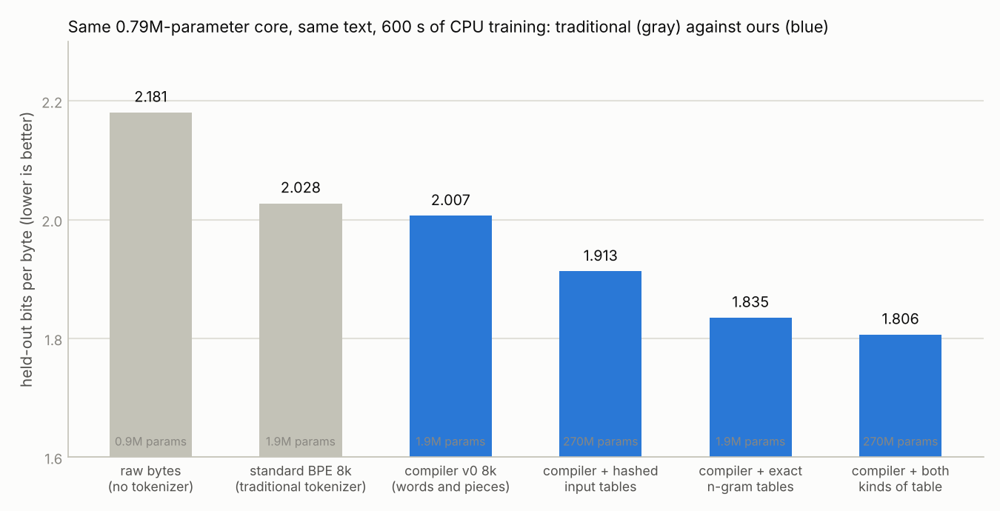
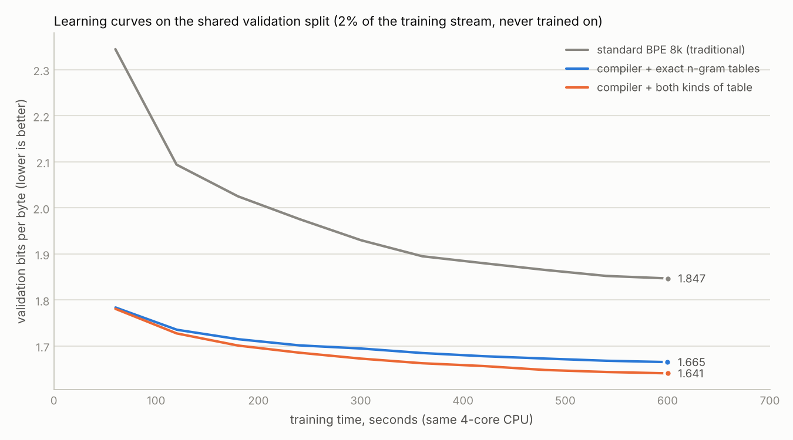

# Encoder research: repository review and plan for the next phases

*Prepared from the state of the repository on 8 October 2026. Research concept and direction by Adam Barnett.*

This document reviews the repository as it stands after the Compiler v0 work and lays out the next phases of the encoder research. It is the working plan for the branch; the broader rationale and the reading list are in the research-plan doc on Claude Docs ("Encoded-Text Model Research Plan"). The V1 semantic system keeps its own plan in [`MASTER_PLAN.md`](../MASTER_PLAN.md).

## 1. Summary

- **Compiler v0 is sound.** The 19 contract tests pass here (Python 3.13, g++ 13.3) and on both CI platforms. Every configuration round-trips exactly and the C++ encoder matches the Python reference byte for byte. Plain v0 matches an in-house BPE at 32k entries on both sequence length and n-gram structure, while being stateless, global and about 25× faster than the Python reference.
- **Nothing is merged.** `main` still holds only the zip, README and LICENSE. All real work sits on `unpack-project` (the unpacked V1 project plus CI) and `encoder-v0` (the encoder). No pull request exists. CI is red on Ubuntu because of six V1 tests with Windows-recorded initialization hashes, not because of the encoder.
- **The measurement so far is a proxy.** The n-gram score cannot rank encodings that differ in unit size, so the phrase question (27–33% shorter sequences for a 3–4% worse proxy) is open until a neural model is trained. That neural comparison, Track A, is still the first experiment.
- **Four encoder weaknesses were measured during this review**, none of them visible in the earlier results: hard-wrapped Gutenberg lines strip the leading space from about 12% of words; punctuation clusters cost one ID per byte; UTF-8 punctuation costs three IDs per character; and case flags cost a sequence position for what is really an attribute of a word. Section 2.3 has the numbers and section 4 (Phase 0) the fixes to test.
- **The sandbox can now install from PyPI**, so the earlier blocker on PyTorch is gone: PyTorch installed and trained a test model on CPU during this review (details in 2.5). A calibration of the Phase 1 model shape shows the 32k output layer is about 87% of a training step at width 128, which moves the factorized output of Track C up in priority. The repository is public, so GitHub Actions runners are free compute for the Track A ladder.
- **Plan in one line:** Phase 0 fixes the corpus, the encoder's measured weaknesses and the tooling; Phase 1 runs the neural learnability ladder (Track A) and picks the encoder; Phases 2–5 then spend parameters on tables (B), factorize the IDs (C), add the number channel and multi-unit prediction (D, E), and benchmark against learned chunking (F).
- **Updated 9 October (section 3a):** on Adam's steer the work moved from reviewing to running. A training harness now exists, the first ladder of six encodings has been trained, including a dictionary-free equation encoder, and every model is tested by talking back through its own compiler.
- **Where it stands at the end of 9 October:** the best configuration (compiler + hashed input tables + exact n-gram output tables with leave-one-out counting) is 10.9% better than a traditional BPE-tokenized model with the same core, text and training time, 17% better than raw bytes, and answers twice as fast as the byte model. Details, figures and the one-time side-by-side are in section 3a.

## 2. Repository review

### 2.1 Branches, CI and open items

| Branch | Head | Contents | State |
| --- | --- | --- | --- |
| `main` | `0cfd5c8` | README, LICENSE, `barnetts-model-v1-experimental.zip` | Unchanged since the upload |
| `unpack-project` | `e45db6d` | V1 scripts, checkpoints, docs, results, CI on Ubuntu and Windows with failure annotations | 3 commits ahead of `main` |
| `encoder-v0` | `0c19ab3` | `unpack-project` plus `compiler/` and `results/compiler_v0_initial.json` | 4 commits ahead of `main` |
| `claude/gracious-hypatia-hk74hn` | this commit | `encoder-v0` plus this plan | Working branch for this session |

- **CI.** Four workflow runs, all red on `ubuntu-latest` and green on `windows-latest`. The failing step is the V1 semantic suite: the test that pins lexical initialization hashes recorded them on Windows and PyTorch's CPU initialization differs by platform. The Compiler v0 suite passes on both runners. The fix is a decision for Adam (section 6): record per-platform hashes, or run that one test on Windows only.
- **No pull request** has been opened for either branch. Merging `encoder-v0` into `main` (it already contains `unpack-project`) would make the encoder visible from the default branch and let README links resolve.
- **The TC0 draft files** (`compiler/CMakeLists.txt`, `tc0.h`, `tc0.py`, `tc0_cli.cpp`, `test_tc0.py`) were never committed. They existed only in the previous session's container and are not in this fresh clone. If Adam has copies, they can still go on a branch of their own; otherwise they are gone.
- **The 45 MB corpus** is not in the repository (`data/` is ignored) and must be rebuilt with `compiler/experiments/prepare_books.py`, which clones from GITenberg. Cloning works from this environment.

### 2.2 Compiler v0: what is solid

- The specification lives in one place, the module docstring of `compiler/compiler_v0.py`, and the C++ header points to it. The scanner rules, ID layout and both file formats are short enough to hold in one's head.
- Losslessness is by construction (byte IDs 0–255 as the fallback) and is tested on all 256 byte values, random input and adversarial strings.
- The dictionary is a canonical text file whose FNV-1a hash travels in every ID file, and decoding with the wrong dictionary is rejected in both implementations. This is the discipline the V1 lexicon already used.
- Fitting is deterministic (sorted inputs, tie-broken heaps), so a dictionary can be regenerated from the same corpus and the hash checked.
- The native encoder is simple: one open-addressing table per entry kind, a bounded lookahead for phrases, no allocation per unit. 112 MB/s encode and 300 MB/s decode on one core is enough that encoding will never be the bottleneck of training or inference.
- The experiment script records the machine, corpus sizes, fit times and dictionary hashes alongside every number, which is the right habit.

### 2.3 Findings that change the plan

The numbers below come from the two held-out books that could be re-fetched quickly (Heart of Darkness, 211 KB UTF-8; The Adventures of Sherlock Holmes, 563 KB from the Latin-1 source), cleaned exactly as `prepare_books.py` cleans them.

**F1. Hard line wraps split the vocabulary in two.** Gutenberg texts are wrapped at 44–63 bytes per line. A word that starts a line has no leading space, so it is a bare unit and needs its own dictionary entry (`the` as well as `" the"`).

| Book | Words | Bare words | …of which line-initial | Newline units (share of all units) |
| --- | ---: | ---: | ---: | ---: |
| Heart of Darkness | 39,080 | 4,657 (11.9%) | 2,873 | 3,099 (6.0%) |
| Sherlock Holmes | 105,925 | 12,264 (11.6%) | 7,790 | 10,079 (7.2%) |

About two thirds of bare words are line-initial, so roughly 7% of all words get a rarer, duplicate ID purely because of the 1990s file format, and 6–7% of all units are newline runs that a model trained on modern text would almost never see. Text the model will meet in use is not hard-wrapped. **Fix:** unwrap paragraphs in corpus preparation (join single newlines inside a paragraph into a space, keep blank-line paragraph breaks) and record both corpus variants. The remaining bare words (after quotes, brackets and dashes) are legitimate.

**F2. Punctuation clusters cost one ID per byte.** Every non-letter byte is its own unit and pieces need units of at least two bytes, so `."`, `?"`, `,"` and `--` can never become one ID without the phrase table. ASCII punctuation is 16.4–16.5% of all units in both books. Runs of two or more punctuation bytes would save 2.3–2.4% of all IDs if a run were one unit (1,253 and 3,234 IDs in the two books; the top runs are `--`, `."`, `?"`, `,"`, `.'`, `...`). BPE merges these for free; v0 should too. **Fix to test:** a scanner rule making a run of ASCII punctuation one unit, so pieces can be learned for it.

**F3. UTF-8 punctuation costs three IDs per character.** Non-ASCII characters are split into single bytes, so a curly quote or an em dash is three IDs. In the UTF-8 copy of Heart of Darkness this is 1.3% of all units (684 byte IDs for 228 characters, nearly all `“`). The Latin-1-sourced Sherlock text has almost none, which is why the earlier results did not show it. Modern text uses curly quotes and dashes everywhere. **Fix to test:** a scanner rule making a valid UTF-8 multibyte sequence one unit (invalid sequences stay single bytes, so the encoder stays lossless).

**F4. Case flags are the right idea in the wrong place.** `CAP` + `" the"` keeps one ID for "the" and "The", which is what Tracks B and C want, but costs a sequence position, which is why the initial tests turned the flags off (6% longer sequences for no proxy gain). The flag is an attribute of the word, not a unit of text. **Fix to test:** fold the flag in the training loader: a `CAP`/`UPPER` ID and the word that follows become one model token with two fields (word, case), and the model embeds it as the sum of a word vector and a case vector. The file format does not change; sequence length equals plain v0; the word vector is shared across cases. This is the first instance of the structured-ID idea (Track C) and it costs nothing on the encoder side.

**F5. Phrase IDs trade away ID stability.** A phrase entry turns `" of the"` into one ID, so `" the"` has a different representation depending on the word before it. Track A must still measure phrases, because they are the cheapest way to shorten sequences. But Tracks B and C build on the assumption that a word's ID is stable, so they should start from plain v0, and phrase-level information should enter the model through hashed n-gram input tables (Track B) or multi-unit prediction (Track E), which keep the sequence stable.

**F6. The BPE baseline is in-house.** `BPEBaseline` learns merges with the same pair-merge code on the same scanner units. That is a fair like-for-like control, but the research claim ("matches standard BPE") needs an external anchor. `tiktoken` installs from PyPI here; the GPT-2 50k and `cl100k_base` encodings should be added to the ladder as reference points for IDs per KB and for the neural comparison.

**F7. The corpus is small for a neural comparison.** 45 MB is about 11.4M plain v0 IDs. A model with 3M non-embedding parameters sees that in one pass in a reasonable time; a 25M-parameter model, the size the earlier plan named, would be badly under-trained on it (the usual guide is about 20 training tokens per parameter). Phase 1 therefore uses a 1–4M-parameter core on the 45 MB corpus, and Phase 2 needs the larger corpus (200 MB–1 GB) before it can say anything about 64k–256k vocabularies.

**F8. Held-out contamination by author.** The Adventures of Sherlock Holmes is held out, but A Study in Scarlet and The Hound of the Baskervilles are in training. The other two held-out books have no author overlap. Keep the set, but add one held-out book whose author is absent from training, and report per-book bits per byte so the effect is visible.

**F9. Out-of-domain cost is large and expected.** Dictionaries fitted on novels need 231–278 IDs per KB on the repository's Markdown and 317–375 on its Python code, against 170–254 on books. Any real training dictionary must be fitted on the same mix of text the model will see. Decide the mix (section 6) before fitting the Phase 1 dictionaries, or state plainly that Phase 1 is a books-only study.

### 2.4 Smaller code notes

None of these block anything; they are recorded so they are not rediscovered.

- `read_ids` returns a Python list. For training, read the ID file with `numpy.fromfile(path, dtype="<u2", offset=24)` after checking the header; a small loader module should do that and verify the dictionary hash (Phase 0).
- The Python `Dictionary.parse` rejects a non-canonical dictionary file; the C++ parser accepts it and hashes the raw bytes. The mismatch surfaces as a hash error later rather than at load time. Making C++ re-serialize and compare, or adding a test that both reject the same file, closes the gap.
- `learn_pieces` stops when the best pair falls below `min_count` (default 2), so no singleton piece is ever created. Good for generalization; worth stating in the README.
- The ID file has no checksum of its body, only a length check. Fine for research files; add one if ID files are ever shared.
- The experiment script asserts C++/Python parity on the held-out books for every configuration, which is the strongest check in the suite. Keep that pattern for every new encoder flag.
- `results/compiler_v0_initial.json` records `cores: 2`; this container now reports 4 cores and 15 GB, so speed numbers from different sessions are not directly comparable. Record the CPU model string as well as the core count.

### 2.5 Environment and compute

- **PyPI is reachable directly** from this container (the proxy's bypass list includes `pypi.org` and `files.pythonhosted.org`), so `pip install` works; `numpy` and `tiktoken` wheels downloaded without trouble. `download.pytorch.org` is still blocked (HTTP 403 from the proxy), so the small CPU-only PyTorch wheel is not available. The PyPI wheel for `torch` 2.14.1 is the CUDA build (555 MB plus CUDA libraries). An install of it was started during this review; the outcome is recorded at the end of this section.
- **GitHub Actions is free compute for this public repository.** A `workflow_dispatch` workflow can run the Track A ladder as a matrix, one encoding per job (4 vCPU, 16 GB, 6-hour limit per job), upload each result JSON as an artifact and aggregate them in a final job. This parallelizes the ladder and removes the dependency on the sandbox's lifetime.
- **Adam's machine** is the third option. The V1 README notes training can use CUDA when available. A single consumer GPU would run the whole Phase 1 ladder in an evening.
- Sandbox resources at review time: 4 cores, 15 GB RAM, about 30 GB free disk, Python 3.13.16, NumPy 2.5.3, g++ 13.3.

**PyTorch install result:** the PyPI wheel installed in 4 min 40 s and imports and trains on CPU (`torch` 2.14.1+cu130, 4 threads, CUDA reported unavailable). Disk cost 5.3 GB (site-packages grew from 0.5 GB to 5.8 GB), leaving about 22 GB free. So Track A can run in the sandbox at CPU scale; the calibration below says which runs should go elsewhere.

**Calibration of the Phase 1 model shape** (random IDs, batch 8, context 256, AdamW, fp32, CPU, 4 threads, mean of 6 steps after warm-up):

| Shape | Non-embedding params | Total params | Seconds per step | IDs per second | One pass over 45 MB of text |
| --- | ---: | ---: | ---: | ---: | ---: |
| bytes, width 128, 4 layers | 0.79M | 0.86M | 0.19 | 11,000 | 1.1 h (45M IDs) |
| v0 32k, width 128, 4 layers | 0.79M | 5.02M | 1.46 | 1,400 | 2.3 h (11.4M IDs) |
| v0 32k, width 256, 4 layers | 3.16M | 11.61M | 3.89 | 530 | 6.0 h (11.4M IDs) |

The byte model and the 32k model do the same core work per step, so the 1.27 s difference at width 128 is the embedding and the tied 32k output layer: about 87% of the step. At this scale a 32k vocabulary costs more per pass over the same text than bytes do, despite the sequence being four times shorter. Two consequences for the plan: the 32k runs belong on Actions (in parallel) or a GPU while the sandbox takes the byte and small-vocabulary runs, and the factorized output layer of Track C is the main speed lever for small models, so its output half moves up in priority (Phase 3). The Phase 1 "equal compute" budget is therefore defined in IDs processed, with wall-clock reported beside it.

## 3. The question being tested

The thesis has two halves and the plan keeps them apart so that each can fail on its own.

1. **A tiny deterministic encoder is enough.** One stateless pass with one frozen dictionary keeps as much learnable structure as a learned tokenizer, produces shorter sequences, and is fast enough to be invisible. Track A tests this.
2. **Capacity can live in tables.** Given stable IDs, most of a model's parameters can sit in lookup tables (large input vocabularies, hashed n-gram tables, factorized embeddings, product-key memories) while a small compute core does the rest, so the model has many parameters but few FLOPs per step. Tracks B and C test this.

Speed is a constraint on both halves: the encoder must stay single-pass, and every table design is judged at matched step time, not just matched bits per byte.

The reading of "a smaller model with far more parameters" as "small core plus large tables" is still unconfirmed by Adam (the open comment thread on the research-plan doc). The plan proceeds on that reading and flags it in section 6.

## 3a. Direction set on 9 October

Adam's steer, in his words as near as matters: the compiler is the go-between in both directions. The training set is compiled to the encoded form and the model is trained on that; at chat time the user's text is compiled the same way, the model answers in codes, and the compiler turns them back into text. The hypothesis is that a model trained this way can be much smaller, carry far more parameters, and run far faster than current text models. The mechanism he has in mind: if one code means "we went to the park", the model learns that with far less machinery, and the conversation happens in a fraction of the symbols. The encoder need not be a fitted dictionary; it could be an algorithm or an equation. Stop reviewing outside work and run our own experiments, including not tokenizing at all (text directly) and encoding into something like a computer language. The encoder was made deterministic precisely so that one compiler serves training and conversation alike.

What this changes in the plan:

- **Outside reading stops.** A paper is cited from here on only when it saves us from repeating a known failure. Everything else is our own measurement.
- **Every experiment has a talk-back test.** After training, the model continues a compiled prompt and the same compiler decodes the answer (`compiler/experiments/chat.py`). Generated bytes per second is reported beside bits per byte, because speed is half the claim.
- **The encoder family widens.** Text directly (bytes); fitted dictionaries at several chunk sizes (words, phrases of up to 3 units, phrases of up to 6); equation encoders with no fitted table (hash coordinate codes); and, next, deterministic rewriting into a canonical form, which is the testable core of the "computer language" idea.
- **The loop is build, train, measure, explain, adjust.** Each ladder trains the same small model on the same text for the same wall-clock budget, once per encoding. Failures are written up with a cause and a change, then re-run. Results accumulate in section 8 and in `results/`.

**What "no dictionary" can and cannot mean.** An equation encoder is a pure function from a unit of text to a number: every word that will ever exist already has a code, nothing is fitted, nothing is chosen. Three facts follow and all three are measured in ladder 1 rather than assumed:

1. Decoding needs an inverse, and a hash has none. So the compiler keeps a reverse map of every unit it met while compiling the training set. That is a table, but not a fitted one: no selection, no frequency threshold, no vocabulary budget. Two units can share a code; the more frequent one wins and the loss is counted (`unit_mass_lost`).
2. A word the training set never contained can be compiled but not decoded, and the model has never seen its code. The dictionary encoder handles the same word through byte pieces. The honest comparison records the share of held-out bytes that come back exactly (`fidelity`).
3. The code space is far larger than the codes in use (16.8M codes, about 126k in use on this corpus). Left alone, the model spends probability on codes that mean nothing, and its first outputs were mostly undecodable. Restricting the member softmax to codes in use fixed that (3.92 against 5.39 bits per byte in a 20-second smoke test). With that restriction the equation encoder is a dictionary whose IDs are coordinates instead of positions. What remains different, and is the real thing under test, is the factorized embedding (4,096 + 4,096 vectors instead of one per entry) and the two-stage output (two softmaxes of 4,096 instead of one over everything in use).

### Ladder 1

Six encodings, one model (4 layers, width 128, context 256 tokens, batch 16), the same 45 MB of training text, 600 seconds of training each on the same 4-core CPU, seed 1. Fitting happened on the training split only. Code: `compiler/experiments/ladder1.py`, `train_lm.py`, `ladder_encodings.py`. Raw results: `results/ladder1.json`.

**Equal training time (600 s each, 4-core CPU).** Held-out is the three books; OOD is the repository's Markdown and Python. "MB seen" is how much training text each model got through in its 600 s.

| Encoding | Params | IDs/KB | Held-out bits/byte | OOD bits/byte | MB seen | Steps | Train IDs/s | Talk-back bytes/s |
| --- | ---: | ---: | ---: | ---: | ---: | ---: | ---: | ---: |
| bytes (text directly) | 0.86M | 1000.0 | 2.181 | 4.537 | 15.1 | 3,682 | 25,130 | 293 |
| v0 8k, words and pieces | 1.87M | 283.0 | 2.007 | 4.062 | 18.1 | 1,277 | 8,715 | 732 |
| v0 8k + 1,024 phrases of up to 3 units | 1.87M | 232.7 | 2.057 | 4.029 | 21.2 | 1,198 | 8,174 | 968 |
| v0 8k + 2,048 phrases of up to 6 units | 1.87M | 233.3 | 2.075 | 4.053 | 21.7 | 1,217 | 8,307 | 744 |
| hash 4096×4096 (equation, no dictionary) | 3.45M | 240.7 | 2.037 | 4.374 | 17.1 | 1,048 | 7,153 | 589* |
| v0 8k + hashed bigram table, 2^20 rows | 136.09M | 283.0 | **1.939** | 4.121 | 15.7 | 1,110 | 7,574 | 848 |

\* In the ladder run the hash model talked back at 258 bytes/s because the sampler recomputed its group mask at every step. With the mask precomputed, a re-run of the same configuration gave 589 bytes/s and 2.034 bits per byte (2.037 in the ladder run: the two runs agree to 0.2%, a first measure of run-to-run noise). A checkpoint from the re-run is the one `chat.py` was tried on.

**Equal training text.** Validation bits per byte (a 150 KB slice of Heart of Darkness, measured every 120 s) read off each curve at 15.1 MB, the most the slowest run saw, and at 10 MB.

| Encoding | bits/byte at 10 MB | bits/byte at 15.1 MB | seconds to reach 15.1 MB |
| --- | ---: | ---: | ---: |
| bytes | 2.347 | 2.232 | 600 |
| v0 8k | 2.167 | 2.109 | 500 |
| v0 8k + phrases ≤3 | 2.243 | 2.184 | 428 |
| v0 8k + phrases ≤6 | 2.271 | 2.199 | 414 |
| hash 4096×4096 | 2.141 | **2.099** | 529 |
| v0 8k + table | **2.086** | **2.030** | 576 |

Per book, every encoding ranks the same way, and every model is bad on the out-of-domain files (4.0–4.5 bits per byte) because training was books only.

**Hash encoder fidelity** (share of held-out bytes that decode back exactly): Heart of Darkness 98.70%, Sherlock Holmes 98.41%, The Prince 95.67%. The rest is units never seen in training (1.3%, 1.5% and 4.2%); collisions cost under 0.1%. In training, 126,005 distinct units mapped to 125,497 codes; 508 units were lost to collisions, 0.02% of unit occurrences.

**Talk-back** (prompt "We went to the park", 200 tokens, same sampling for all): the byte model after 10 minutes produces word-like noise ("enession me souticing mysterning on to careful the side"); the compiled models produce words and phrases in grammatical runs ("and she stood in the world. “You are that I was not to you!”"; "he came up to his own ping all his hat and got his back to the table"). None of them makes sense yet; they are 10-minute models. The point of the test is that the loop works: text in, codes to the model, codes out, text back, through one deterministic compiler.

**What worked.**

1. *Compiling the text beats feeding it raw.* At equal compute the word-and-piece dictionary gives 8.0% fewer bits per byte than bytes, and the model talks back 2.5× faster in bytes per second. At equal text seen it is still 5.5% better. Shorter sequences let the same core see 20% more text in the same time, and each step predicts a whole word.
2. *Parameters in a table are nearly free.* Adding a hashed bigram table of 2^20 rows, 134M parameters, to the 1.9M-parameter model gave the best result of the ladder, 1.939 bits per byte, 3.4% better than the same model without it at equal time, 3.7% at equal text. Training steps were 13% slower and talk-back speed did not drop. This is the first direct evidence for the thesis: 73× the parameters at close to the same speed, and better.
3. *An equation can replace the fitted dictionary.* The hash encoder, with no vocabulary chosen by anyone, lands between the dictionary and the phrases at equal time (1.5% behind the dictionary) and ahead of the dictionary at equal text (2.099 against 2.109), because every word in training is one code: there are no pieces. Its costs are measured, not guessed: 1.3–4.2% of held-out bytes are units it never saw and cannot decode, and out-of-domain text suffers most (4.37 bits per byte against 4.06) for the same reason.

**What failed, and why.**

4. *Phrase IDs made the model worse.* Both phrase dictionaries cut sequence length by 18% and let the model see the most text (21–22 MB), yet they scored 2.5–3.4% worse than plain words at equal time and 3.5–4.3% worse at equal text. Two causes, both structural: a phrase is a rarer unit than its words, so each phrase code gets fewer training examples; and a phrase hides the identity of its words (" of the" shares nothing with " of" or " the"), so the model learns the same words' behaviour twice. Phrases of up to 6 units did not shorten sequences any further than 3 (233 against 233 IDs per KB), because in an 8k budget long phrases are too rare to earn slots, and the 2,048 phrase slots displaced word pieces. "One code for 'we went to the park'" therefore fails as a sequence device at this scale. The idea survives in two other places: as table rows (the bigram table carried phrase-level knowledge into the input without changing the sequence, and won), and as a prediction device (several units per step, Track E), which is where the speed should come from.

**Caveats.** One seed, 600 CPU-seconds, a 0.8M-parameter core on 45 MB of English novels. The gaps between bytes and the compiled encodings (5–8%) and the table's gain (3–4%) are larger than seed noise usually is for runs like these; the 1.5% between the dictionary and the hash encoder is not, and needs a second seed before it is believed. Every curve was still falling steeply at 600 s, so absolute numbers mean little; the ordering is the result.

**What to change next (ladder 2).**

- *Table scaling:* 2^18, 2^20 and 2^22 rows, and a trigram table beside the bigram, at the same core. This draws the curve the thesis needs: bits per byte against parameters, with step time and RAM beside it. (Run in this session if time allows; the code supports it.)
- *Hash encoder, lossless:* units never seen in training fall back to byte codes, as the dictionary does, so every text round-trips; case-folded units so "The" and "the" share a code; and a three-coordinate variant (256×256×256, three 256-way softmaxes) to see how cheap the output can get.
- *A second seed* for bytes, v0 8k, hash and table, to put error bars on the ordering.
- *Longer budgets* (30 min) for the best three, to see whether the ordering holds as the curves flatten; the width-256 repeat belongs on Actions or a GPU.
- *Speed from the output side, not the sequence:* multi-unit prediction heads on the word encoder (Track E), since phrases in the sequence cost quality.

### Ladder 2a: how far do the tables scale? (9 October)

Same core, same text, same 600 s, seed 1. The 2^20 row is the ladder 1 run; the others are new (`results/ladder2a.json`). "At 15.1 MB" is the equal-text reading from each run's validation curve.

| Input tables on v0 8k | Table params | Total params | Held-out bits/byte | At 15.1 MB | Steps | Train IDs/s | Talk-back bytes/s |
| --- | ---: | ---: | ---: | ---: | ---: | ---: | ---: |
| none | 0 | 1.9M | 2.007 | 2.109 | 1,277 | 8,715 | 732 |
| bigram, 2^18 rows | 33.6M | 35.4M | 1.931 | 2.029 | 1,210 | 8,258 | 637 |
| bigram, 2^20 rows | 134.2M | 136.1M | 1.939 | 2.030 | 1,110 | 7,574 | 848 |
| bigram, 2^22 rows | 536.9M | 538.7M | 1.916 | 2.014 | 1,197 | 8,166 | 707 |
| bigram + trigram, 2^20 rows each | 268.4M | 270.3M | **1.913** | **2.006** | 1,168 | 7,970 | 759 |

What it says:

1. *Every table helps, by 3.4–4.7%, and the cost stays small.* Steps per second drop 5–13%, talk-back speed is unchanged within noise, and the 2^22 table (537M parameters, 6.4 GB with its optimizer state) trained without trouble on this machine. "Far more parameters at nearly the same speed" holds across a 16× range of table sizes.
2. *Rows scale weakly at this data size.* Going from 2^18 to 2^22 rows, 16× the parameters, buys 0.8% (1.931 to 1.916). The 2^20 point is no better than 2^18. A 17 MB pass touches most rows of a 537M-parameter table only a handful of times, so the extra rows are mostly empty. Table capacity has to grow with the data, which is the case for the larger corpus in Phase 0.2 before any bigger table is tried.
3. *Context order beats row count.* A trigram table beside the bigram one (268M parameters) does slightly better than quadrupling the bigram table (537M): 2.006 against 2.014 at equal text. The next table experiments add orders (4-grams, skip-grams) before they add rows.
4. *The ordering was fixed by minute 4* here too (validation 2.177, 2.171, 2.167 and 2.156 bits per byte for 2^18, 2^20, 2^22 and bigram+trigram at 240 s, the same order as at 600 s). Together with ladder 1 this sets the screening budget from here on: 4 minutes to rank ideas, 10 minutes only to confirm the best two or three, longer only for a configuration that has passed both.
5. *Run-to-run speed noise is about ±8%* in steps per second on this shared machine (the 2^20 run was the slowest although it is not the largest), so differences in the equal-time column below about 1% are not meaningful; the equal-text column is the one to read for small gaps.

Next for tables (ladder 2b, 4-minute screens): do the gains stack on the equation encoder (hash codes + tables) and do they rescue the byte model (bytes + tables)? Then more orders rather than more rows, and the bigger corpus.

### Ladder 2b screen: do the tables stack on other encoders? (9 October, 4-minute runs)

First use of the 4-minute screening budget (`results/ladder2b_screen.json`). Bigram and trigram tables of 2^20 rows each, on three base encoders. Numbers are held-out bits per byte at 240 s; they are not comparable with the 600 s tables above, only with each other.

| Base encoder | Without tables | With bigram + trigram tables | Gain |
| --- | ---: | ---: | ---: |
| v0 8k words and pieces | 2.189 | **2.140** | 2.2% |
| hash 4096×4096 (no dictionary) | 2.215 | 2.183 | 1.4% |
| raw bytes | about 2.49* | 2.314 | about 7% |

\* Bytes alone was not re-run at 240 s; the figure is read off the ladder 1 byte run's validation curve at 240 s (2.553) scaled by that run's validation-to-held-out ratio at 600 s (0.977).

1. *Tables help every encoder, and most where the units carry least.* On bytes the rows act as learned character n-grams, a crude tokenizer inside the model, and buy about 7%. Even so, bytes with 269M parameters of tables stays 5.7% behind plain words with none: at this budget the compiler does work that a table does not replace.
2. *Tables help the hash encoder least* (1.4% against 2.2%). Whole-word units make far more distinct bigram and trigram types than 8k pieces do, so the hashed rows collide more, and the hash model also gets the fewest steps per second. To test next: larger tables for the hash encoder, or tables keyed on the group coordinate alone, which is coarser.
3. *Hash alone trails plain words by 1.2% at 4 minutes*, as it did by 1.5% at 10. The gap is small and consistent. The likely cause is rare words: in the dictionary a rare word is spelled from shared pieces, in the hash encoder it is one code seen a handful of times.
4. *The dictionary with tables stays the best configuration* at 4 minutes as at 10, and the 4-minute screen reproduced the 10-minute ordering, so the screening budget holds.

The bigger-core control settles the table story at this scale (`results/control_v0_8k_w256.json`): v0 8k words, no table, width 256 instead of 128 (core 3.16M parameters instead of 0.79M, total 5.3M), 600 s.

| Where the parameters go | Total params | Held-out bits/byte at 600 s | At 10 MB of text | Steps | Train IDs/s | Talk-back bytes/s |
| --- | ---: | ---: | ---: | ---: | ---: | ---: |
| core at width 128, no table | 1.9M | 2.007 | 2.167 | 1,277 | 8,715 | 732 |
| core at width 256, no table | 5.3M | 2.003 | 2.114 | 809 | 5,517 | 494 |
| width 128 + bigram and trigram tables | 270M | **1.913** | **2.072** | 1,168 | 7,970 | 759 |

Quadrupling the core's parameters bought nothing at equal time (2.003 against 2.007): the wider core learns 2.4% more per byte of text but runs 37% fewer steps, and it answers 33% slower. The tables bought 4.7% at equal time and 2% more than the wider core at equal text, at a 9% step cost and no loss of talk-back speed. The Track B gate ("tables match or beat the gain from doubling the core at no more than 10% extra step time") is passed, against a core that was quadrupled rather than doubled. At this scale, parameters are better spent in tables than in the compute path, for both quality and speed.

### Ladder 2c: seed noise and a 4-gram table (9 October, 4-minute runs)

`results/ladder2c_seed2.json` repeats the key pair with seed 2; `results/ladder2c_orders.json` adds a 4-gram table to the bigram and trigram ones.

| Configuration | Seed 1 | Seed 2 | Spread |
| --- | ---: | ---: | ---: |
| v0 8k words, no table | 2.189 | 2.193 | 0.2% |
| v0 8k + bigram and trigram tables (270M) | 2.140 | 2.127 | 0.6% |
| v0 8k + bigram, trigram and 4-gram tables (405M) | 2.140 | | |

- *Seed noise is small.* Two seeds differ by 0.2–0.6% at 4 minutes, with step counts that differ by up to 12% between runs on this shared machine. The table gain (2.2–3.0%) and the gap between compiled text and bytes (5–8%) are well outside it; the 1.2–1.5% gap between the dictionary and the hash encoder is at its edge and still needs a confirming seed.
- *A 4-gram table adds nothing at this data size* (2.140 with it, 2.140 and 2.127 without), while adding 134M parameters and a lookup. At 13M training tokens almost every 4-gram context is seen once. Orders beyond 3 wait for the larger corpus.

### Ladder 2d: exact n-gram tables at the output, first attempt (9 October, 4-minute runs)

The idea: a plain 3-gram count model beat every 10-minute neural model, so make the counts part of the model. For every bigram and trigram context in the training text the table keeps its 16 most frequent followers; at each position the network predicts how much to trust itself, the bigram table and the trigram table, and the loss is the mixed probability of the true next code. The tables hold 3.3M follower entries built in four seconds; they are counts, not parameters. `results/ladder2d_ngram.json`.

| Configuration | Learned params | bits/byte at 60 s | at 240 s | Out-of-domain | MB seen |
| --- | ---: | ---: | ---: | ---: | ---: |
| v0 8k words, no table | 1.9M | 2.547* | 2.189 | 4.23 | 7.1 |
| v0 8k + hashed input tables | 270M | 2.591* | 2.140 | 4.28 | 6.4 |
| v0 8k + exact n-gram output tables | 1.9M | 2.252* | 2.140 | 5.20 | 9.9 |
| both | 270M | 2.248* | 2.155 | 5.37 | 9.4 |

\* validation slice; the other columns are the full held-out set.

What happened: the counts gave an immediate head start (at one minute the n-gram model was already where plain words got to after four), then learning stalled (2.25, 2.22, 2.24, 2.22 on the validation slice at minutes 1 to 4), and out-of-domain text got much worse (5.20 against 4.23). With the input tables as well it was worse still. **Cause:** the tables were counted on the same text the model trains on. During training, a trigram context seen once in the corpus "predicts" its next word with probability 1, because that very occurrence is in the count, so the mixture head learns to trust rare contexts far more than they deserve on unseen text, and the network, shielded by the tables, gets little gradient to learn with. On held-out books the tables are right less often, on Markdown and code hardly ever, and the over-trust shows up directly. **Fix:** leave-one-out counting during training (subtract the current occurrence from the table's count before the model sees it), so the table looks to the training step the way it will look on new text. Implemented and re-screened below.

### Ladder 2d, second attempt: n-gram tables with leave-one-out counting (9 October, 4-minute runs)

Same two configurations, same budget, with the current occurrence removed from the counts during training (`results/ladder2d_ngram_loo.json`). The best results of the whole programme so far, in four minutes:

| Configuration | Learned params | Validation at 60 / 120 / 180 / 240 s | Held-out bits/byte | Out-of-domain | Talk-back bytes/s |
| --- | ---: | --- | ---: | ---: | ---: |
| v0 8k words, no table (reference) | 1.9M | 2.547 / 2.342 / 2.292 / 2.276 | 2.189 | 4.23 | 686 |
| v0 8k + hashed input tables (reference) | 270M | 2.591 / 2.320 / 2.245 / 2.223 | 2.140 | 4.28 | 560 |
| v0 8k + exact n-gram output tables, leave-one-out | 1.9M | 2.022 / 1.973 / 1.956 / 1.949 | **1.881** | **4.04** | 606 |
| both kinds of table, leave-one-out | 270M | 2.040 / 1.973 / 1.943 / 1.933 | **1.870** | 4.08 | 602 |

- *The stall is gone and the head start stayed.* The curves now fall throughout, and the model is better out of domain than plain words (4.04 against 4.23), where the first attempt was far worse (5.20). Leave-one-out was the whole difference.
- *Four minutes beat every ten-minute run.* 1.881 and 1.870 against 1.913 for the best 600 s configuration, with 1.9M learned parameters in the first case. The count tables (3.3M entries, built in four seconds, no training) carry what the small core would otherwise spend its minutes learning, and the core learns the rest: the mixture head decides, per position, how far to trust each table.
- *Both kinds of table together are best, but only just* (1.870 against 1.881), and at 140× the parameters; the exact tables do most of the work.
- *Against the plain 3-gram count model* (1.865 on the same held-out books, fitted on all 45 MB), the hybrid is within 0.3% after four minutes with a 0.79M-parameter core; the 600 s side-by-side below shows whether it passes it.
- *Why this fits the thesis:* the knowledge is in a table that is looked up, not computed, and it is exact rather than learned; the compute core stays tiny. The table scales with data for free (it is counts), and it can be rebuilt without retraining the core, which no learned table can.

Open questions it raises: the mixture currently uses only the 16 most frequent followers per context (the rest fall to the network); top-k, orders beyond 3, and skip-grams are the next knobs, and the tables need the larger corpus to show their real reach.

### The one-time side-by-side: traditional models against ours (9 October, 600 s)

Adam asked for a single comparison against a model that does not attempt any of this, to be run once. The traditional model is a standard BPE tokenizer (merge-order byte-pair encoding learned on the training text, 8,192 entries, the way GPT-2's own tokenizer was built; GPT-2's vocabulary files themselves sit behind a blocked host) feeding the same 0.79M-parameter Transformer. Raw bytes with the same core is the other traditional point. All runs: same text, same core, 600 s on the same 4-core CPU; the two best configurations and the BPE baseline ran together with the validation split and the plateau stop (`results/side_by_side.json`; the stop did not trigger, every curve was still falling at 600 s).



| Model | Params | Held-out bits/byte | Against BPE | Out-of-domain | Talk-back bytes/s |
| --- | ---: | ---: | ---: | ---: | ---: |
| raw bytes, no tokenizer (traditional) | 0.9M | 2.181 | +7.6% | 4.54 | 293 |
| standard BPE 8k (traditional) | 1.9M | 2.028 | 0 | 4.01 | 734 |
| compiler v0 8k, words and pieces | 1.9M | 2.007 | −1.0% | 4.06 | 732 |
| compiler + hashed input tables | 270M | 1.913 | −5.7% | 4.15 | 759 |
| compiler + exact n-gram tables | 1.9M | 1.835 | −9.5% | 3.97 | 572 |
| compiler + both kinds of table | 270M | **1.806** | **−10.9%** | **3.96** | 606 |



What the comparison says:

1. *The compiler alone is a wash against a traditional tokenizer* (1.0% better, within what a second seed could move). Its value is not in the codes themselves but in what stable codes allow: the tables.
2. *The best configuration is 10.9% better than the traditional model at equal time and equal everything else, and 17% better than raw bytes.* It also passes the plain 3-gram count model (1.865) that had beaten every neural run before today. The exact n-gram tables alone, with the same 1.9M learned parameters as the BPE model, are 9.5% better: the gain costs no learned parameters at all, only a count table built in four seconds.
3. *Equal text, not just equal time.* The n-gram runs got through more text in 600 s (23 MB against 17 MB), partly for a reason that is an implementation detail: the models without n-gram tables used a slower form of the loss (cross-entropy on transposed logits, measured at 356 ms against 202 ms per step for the same mathematics), which has been unified since. Read off the curves at the 16.95 MB the BPE model saw, the n-gram models score 1.676 and 1.654 on the shared validation slice against 1.847 for BPE: 9.3% and 10.5% better at equal text, so the conclusion does not depend on the speed difference.
4. *Validation agrees with the test.* On the 2% validation split (training authors) the two best models score 1.843 and 1.811; on the held-out books (unseen authors except Doyle) 1.835 and 1.806. No sign of fitting the training authors.
5. *Speed.* Every compiled model answers 2 to 2.6 times faster than the byte model. The n-gram mixture costs some talk-back speed against plain words (572 to 606 against 732 bytes/s) because the output mixes three distributions per step; that is the next thing to make cheaper, and it is still twice the byte model.

This comparison is not to be repeated; from here the work is improving the best configuration, with these numbers as the reference.

### The scale check: does the gain survive more data? (9 October, 200 MB corpus, 600 s)

Corpus v1 (`results/corpus_v1_manifest.json`): the 45 MB corpus grown to 200.6 MB in 297 books from the same source, held-out authors screened out of training, and Walden (Thoreau, no other Thoreau in training) added as a fourth held-out book. Dictionaries, BPE merges and count tables were refitted on the larger corpus. The best configuration's trust head gained two confidence features (top-follower share and follower entropy) between the side-by-side and this run, so the 45 MB reference was re-run with the new head (`results/side_by_side_newhead.json`: 1.804 against 1.806 before, no material change). Numbers below are on the same three held-out books as every earlier result; `results/scale_check.json`.

| Training text | Standard BPE 8k | Best configuration | Gap |
| --- | ---: | ---: | ---: |
| 45 MB | 2.028 | 1.804 | 11.0% |
| 200 MB | 1.923 | 1.744 | 9.3% |

- *The gain survives a 4.4× increase in data.* Both models improve with more text (BPE by 5.2%, ours by 3.3%) and the gap narrows a little, from 11.0% to 9.3%, which is the expected direction: the network learns some of what the tables hold. It does not collapse. On the new held-out author (Walden) the gap is 8.8% (2.023 against 1.845).
- *Out of domain the hybrid no longer leads at 200 MB:* 3.80 against 3.72 bits per byte on the repository's code and Markdown, where at 45 MB it led (3.96 against 4.01). The count tables are fitted to books and get more confident with more books; off-domain their confidence misleads more often. More table orders and the Wikipedia split in corpus v2 are the levers.
- No run hit the plateau rule; every curve was still falling at 600 s.

### Where the gain lives (200 MB runs, held-out books, bits per byte by class of the predicted token)

| Class of the predicted token | Share of bytes | Standard BPE | Best | Gain |
| --- | ---: | ---: | ---: | ---: |
| 100 most frequent codes | 36.7% | 1.658 | 1.660 | 0 |
| codes ranked 101–1,000 | 29.6% | 2.132 | 1.779 | **16.6%** |
| codes ranked 1,001–8,192 | 33.8% | 2.139 | 1.912 | **10.6%** |
| whole-word codes (all ranks) | 93.3% | 1.872 | 1.655 | 11.6% |
| byte-fallback codes (rare words spelled out) | 5.9% | 3.482 | 3.759 | −8.0% |
| punctuation and spacing | 0.8% | 0.934 | 0.914 | 2.2% |

The gain is not shallow. On the hundred commonest codes, the function words, the two models are identical; the advantage is entirely on the middle and rare vocabulary, where a count table remembers what follows a specific pair or triple of words and a 0.79M-parameter network cannot. The one class where the hybrid loses is words so rare that the compiler spells them in bytes: the tables have almost no counts over byte codes and the hashed rows collide, so the network is left alone and distracted. That is a precise target: a larger dictionary, or the hash encoder for rare words, would move those 5.9% of bytes into the class where the tables win.

### Ladder 3: four-minute screens on the hybrid (9 October, corpus v2, 233 MB)

Corpus v2 (`results/corpus_v2_manifest.json`) is corpus v1 plus 44 books from Adam's 100-book file (15 duplicates and held-out titles dropped by Gutenberg id) and, from his enwik file, a 2 MiB Wikipedia out-of-domain test file and a 48 MiB Wikipedia training split kept separate. Four held-out books. `results/ladder3_screen.json`, `results/ladder3_ctx1024.json`.

| Configuration | Learned params | Held-out bits/byte | Wikipedia (OOD) | Steps | Talk-back bytes/s |
| --- | ---: | ---: | ---: | ---: | ---: |
| reference: hashed 2^20 tables + exact tables, 16 followers | 270M | 1.834 | 4.55 | 622 | 400 |
| exact tables only, 16 followers | 1.9M | 1.846 | 4.56 | 667 | 484 |
| exact tables only, **64 followers** | 1.9M | **1.795** | 4.54 | 672 | 532 |
| hashed 2^18 tables + exact tables | 69M | 1.834 | 4.50 | 641 | 524 |
| reference with a 1,024-code context | 270M | 1.964 | 4.75 | 133 | 433 |

- *64 followers per context is the new best setting:* 2.1% better than the reference with no hashed tables at all, 1.9M learned parameters, and the fastest talk-back of the group. Keeping more of each context's follower distribution lets the mixture cover more of the probability mass exactly.
- *The hashed input tables have become nearly redundant* beside the exact tables (0.7% at 16 followers, and the 64-follower exact tables beat the pair outright). A 2^18 table (69M parameters) does exactly what a 2^20 table (270M) does. The next configuration drops to 2^18 or drops them.
- *A 1,024-code context loses badly at a 4-minute budget* (133 steps against 622): each step costs four times more and attention grows with the square of the length. This says nothing about long context at the scale of the serious run, only that it cannot be screened at 4 minutes.
- Wikipedia text costs every model about 4.5 bits per byte, code about 4.05, Markdown about 3.2: books-only training, as expected. The Wikipedia split exists for the next corpus mix.

**The configuration to carry forward:** the compiler (8k codes) feeding the 0.79M-parameter core, with exact bigram and trigram tables keeping 64 followers per context, leave-one-out counting, and the three-feature trust head. 1.9M learned parameters. Whether to keep a 2^18 hashed table is a 4-minute question for the next session.

### Learning by reading: knowledge added to the tables with no retraining (9 October)

Every Jane Austen book was removed from the 45 MB corpus, the best configuration (exact tables, 64 followers) was trained for 240 s on the rest, and Emma was scored. Then Pride and Prejudice (692 KB, 1.6% of the corpus) was added to the count tables only, the network untouched, and Emma scored again; a control added an unrelated book of similar size (The Secret Garden) instead. `results/learn_by_reading.json`, script `compiler/experiments/learn_by_reading.py`.

| Tables counted on | Bits/byte on Emma |
| --- | ---: |
| corpus without Austen | 1.8199 |
| plus Pride and Prejudice | **1.8092** (−0.59%) |
| plus The Secret Garden (control) | 1.8195 (−0.02%) |

The model learned by reading: one book by the author, added to the tables in seconds with no gradient step, improved prediction of a different book by her 30 times more than an unrelated book of the same size did. The effect is small in absolute terms because one book is 1.6% of the counts and the author's specific word pairs and triples are a small share of any page; the mechanism works, and it is the one capability a learned table cannot offer. Next: measure the same thing with more of the author's books added, and with the trust head re-tuned (not the core) after the addition.

### First talking-bot test: training on question-and-answer text (9 October)

The Alpaca instruction set (52,002 exchanges, 19 MB, non-commercial licence) was rendered as plain text, one exchange per block ("User: ... / Assistant: ..."), and two models were trained on it from scratch for 600 s with the usual validation split: the best configuration (compiler + exact tables, 64 followers) and the compiler alone. Each was then asked ten basic questions through the compiler (`compiler/experiments/ask.py`; answers in `results/qa_answers_ng64.json` and `results/qa_answers_plain.json`).

| Model | Held-out bits/byte on unseen exchanges | Answers |
| --- | ---: | --- |
| compiler + exact tables, 64 followers | **1.356** | fluent Alpaca-style prose, the same opening for every question, never about the question |
| compiler alone | 1.673 | broken fragments and runs of digits, never about the question |

Verbatim, the table model to "What is the capital of France?": *"The first player to the following sentence to add two or more things in the following words is the name of the United States are the most effective ways to conserve water, ..."*; and the same opening to a question that is in its training data ("Give three tips for staying healthy."). The plain model to "What is 2 + 2?": *"199200000 300000107001000005000, 10020.4..."*.

What this shows, and why it is useful rather than merely disappointing:

1. *Prediction and answering are different things.* The tables cut bits per byte on unseen exchanges by 19% against the plain model, the largest table gain measured anywhere, because the answer format and its stock phrases are exactly what counts capture. Neither model answers, because answering needs the question to reach the output, and nothing in the design carries it there.
2. *The lookup key is the problem.* The exact tables are keyed on the last two or three codes. After "Assistant:" those codes are the same for every question, so the tables hand the trust head the same followers every time, and a 0.79M-parameter core with a 256-code window cannot override them with what the question said. Even a memorised training question is not retrieved, because the key never reaches back to it. This is the "tables memorise surfaces, short memory" limitation stated in the plan, now demonstrated.
3. *The fix is Phase 3, not more minutes.* For answering, the key must include the question (the structured state channel, or a retrieval key built from the question's codes rather than the last few), and the core must be large enough to carry the question across the window (the GPU run). Digits also need the number channel: the plain model's digit runs are the byte-level number representation failing under a numeric question.

The chat format itself was learned in minutes by both models (turn markers, sentence shapes, closing a turn and opening the next), so the compiler-and-tables pipeline works end to end for conversation; what is missing is the part that makes the answer depend on the question.

### Design v2, screen 1: the exchange memory on the Q&A data (9 October, three runs)

`compiler/experiments/m2_qa.py`. The compiler's scanner turns every question into a canonical key (its content words); an exchange memory (M2) stores 51,000 training exchanges by key with exact and nearest lookup; the local tables (M1) stay on; the core (M3) trains for 600 s on windows of [nearest other exchange] + [this exchange] so it can learn to use what memory returns. Four groups of questions are answered through the compiler and scored by word F1 against the reference: seen (training questions), paraphrase (held-out questions with a strong nearest key), unseen (the rest), and added (held-out pairs put into memory after training, no training). Results in `results/m2_qa.json`, `m2_qa_run2.json`, `m2_qa_run3.json`; the run 3 core is `models/m2_qa_run3.pt`.

| Question group | Memory path (exact key) | Network, run 1 | Network, run 3 with retrieval bias | Retrieved answer itself |
| --- | ---: | ---: | ---: | ---: |
| seen (200 / 60) | 0.971 F1, 99% exact | 0.128 | **0.233** (first exact answers, 1.7%) | 1.0 |
| added after training (200 / 60) | 0.960 F1, 99% exact | 0.118 | **0.210** | 1.0 |
| paraphrase (44) | no exact key | 0.135 | 0.131 | 0.273 |
| unseen (156) | no exact key | 0.117 | 0.118 | 0.189 |
| held-out, no memory at all (60) | | 0.120 | | |

Run by run:

1. *Run 1 (memory + retrieval-augmented training).* The memory path answers what it holds, 99% exactly, including 200 pairs added in seconds after training: the self-updating knowledge store works, by lookup. The network path ignores the memory entirely: F1 0.12–0.13 in every group, the same as with no memory, and the same generic opening for every question. Yet the nearest exchange in the window improved validation prediction from 1.356 to 1.298 bits per byte: the network reads memory for scoring and cannot act on it when generating.
2. *Run 2 (half the training windows carry the exchange's own text, to teach copying; answers also generated with the tables off).* Copying was not learned (0.131). With the tables off the network's text falls apart (F1 0.04–0.06) but becomes topical for the first time: "water can heat energy" for why ice floats, "global increased" for global warming, "AI customer" for the customer-service question. So the question does reach the network; the network lacks fluency; the tables supply fluency and erase the question; the trust head chooses fluent and generic.
3. *Run 3 (a retrieval bias at generation: codes that occur in the retrieved answer get a bonus of 3 nats, the soft form of the check loop's "answer from evidence").* Where memory holds the right exchange the answers become about the question: seen 0.139 → 0.233, added 0.128 → 0.210, with the first exact answers. Samples: "The global warming... such as the greenhouse effect" to the global-warming question; "AI can be used to quickly and customer service" to the customer-service question. Where memory holds nothing relevant (unseen) nothing changes, as it should. The policy "repeat the retrieved answer when the key overlap is at least 0.5, otherwise generate" scores 0.161 on held-out against 0.13 for generation alone.

What this settles:

- *The memory layer is right and works now:* exact and near lookup by a deterministic key, updated by adding, inspectable. Everything that memory holds is answerable at once.
- *The network cannot yet carry memory into an answer by itself at this scale.* A 0.79M core trained for ten CPU-minutes does not learn to copy from context, and the local tables, keyed on the last codes, overpower it. The retrieval bias is a stand-in for the copy mechanism a larger core would learn; the GPU run is where that gets tested.
- *Fluency and conditioning live in different components* (tables and network) and the mixer cannot yet combine them. That is the Design v2 question for the next screens: tables conditioned on the retrieved exchange, a learned copy head instead of a constant bias, and the number channel (numeric questions still produce digit runs).
- *Paraphrase answering is bounded by retrieval:* the retrieved answer caps at 0.27 F1 on paraphrases, so better keys (inflection folding, synonyms, or a learned key) matter more than better generation for that group.

**Best model, stated plainly.** Text is compiled into 8,192 word-and-piece codes by the deterministic compiler. A 4-layer, width-128 Transformer (0.79M parameters) reads the codes, with two hashed lookup tables (bigram and trigram keys, 2^20 rows each, 268M parameters, one lookup each per code) added to its input. Its output is mixed, per code, with exact bigram and trigram follower counts from the training text (3.3M entries, built in four seconds, rebuilt without retraining), using weights the network predicts from its state and each table's confidence. After 600 s of CPU training: 1.806 bits per byte on unseen books, 3.96 on code and Markdown it was never trained on, about 600 bytes of reply per second on one core.


## 4. Phases

Each phase ends with a written result file in `results/` and a short entry in this document's log (section 8). A phase starts only when the one before it has produced its result, except where noted as parallel.

### Phase 0: foundations (one to two sessions)

Goal: remove the known distortions before any neural number is recorded, so that Phase 1 measures the encoder and not the corpus.

**0.1 Housekeeping**
- Open the pull request merging `encoder-v0` into `main` once Adam decides the CI question (section 6).
- Add `compiler/requirements-research.txt` (numpy, torch, tiktoken) separate from the V1 `requirements.txt`, and a `SessionStart` hook or setup note so a new cloud session is ready without rediscovery.
- Record the environment facts of 2.5 in `compiler/README.md`.

**0.2 Corpus v1**
- Extend `prepare_books.py` with paragraph unwrapping (F1) as an option, and write both variants (`books45-wrapped`, `books45-unwrapped`) with a manifest: book list, bytes, SHA-256 of each prepared file.
- Add one held-out book with no author in training (F8).
- Add a larger split for later phases: a few hundred more GITenberg books to reach 200–300 MB, with the same manifest. Keep the 45 MB set as the fast corpus for all Phase 0 and Phase 1 work.
- Decide the domain mix (F9) with Adam; if books only, say so in every result file.

**0.3 Encoder v0.1 candidates**
Each candidate is a dictionary-level flag, so v0 dictionaries remain valid and every new dictionary has a new hash. Each is measured on the fast corpus with the existing `initial_tests.py` measures (IDs per KB on held-out and out-of-domain text, single-ID word share, the n-gram proxy, C++ speed and parity) before it is allowed into the Phase 1 ladder.
- **U8:** valid UTF-8 multibyte sequences become one unit (F3).
- **PUNCT:** runs of ASCII punctuation become one unit, up to a fixed maximum length (F2).
- **Loader-side case folding:** no encoder change; the training loader merges `CAP`/`UPPER` with the following word into a (word, case) token (F4). Measured in Phase 1, since it only exists inside the model.
- Promotion rule: a candidate enters the ladder if it cuts held-out IDs per KB by at least 2% without worsening the n-gram proxy by more than 1%, with all contract and parity tests passing. Candidates are also combined (U8+PUNCT) and the combination is measured as its own configuration.
- Not in scope for v0.1: digits (Track D), non-ASCII letters (Track F's comparison will show the cost), and any change to the ID file format.

**0.4 Training loader**
- `compiler/loader.py`: memory-mapped reading of `.ids` files with header and hash checks, fixed-length window sampling by ID count and by original byte span, the case-folding transform, and a byte-count side array so bits per byte can be computed exactly for any encoding. Unit tests against `read_ids`.
- An `encode_corpus.py` step that writes the training and held-out ID files for every configuration with the C++ tool and records the dictionary hash, IDs and bytes per file.

**0.5 Compute path**
- A `track_a.yml` workflow (`workflow_dispatch`, matrix over configurations) that builds the corpus, fits or downloads the dictionary, trains one model and uploads `results/track_a/<config>-<seed>.json`. First run with a 50-step budget to calibrate seconds per step on the runner (the sandbox numbers are in 2.5), then set the real budget from that.

Exit criterion for Phase 0: the corpus manifest, the v0.1 measurements and a calibrated seconds-per-step number for each configuration are committed.

*Status, 9 October:* the training harness, the encoding interface (which doubles as the loader of 0.4) and the first ladder exist and ran in the sandbox; the hash reverse map and dictionaries are fitted by the ladder itself. Still open from Phase 0: paragraph unwrapping and the corpus manifest (0.2), the UTF-8 and punctuation scanner rules (0.3), loader-side case folding, and the Actions workflow (0.5).

### Phase 1: Track A, the neural learnability ladder (two to four sessions, mostly waiting on runs)

Question: does a stateless dictionary encoder keep learnability while shortening sequences, and how does it compare with standard BPE and with raw bytes?

**Fixed model.** One decoder-only Transformer for every encoding: 4 layers, width 128, 4 heads, feed-forward width 512, pre-norm, learned positions, tied input and output embeddings, no dropout. That is about 0.8M non-embedding parameters; the embedding adds 0.03M for bytes and 4.2M for a 32k vocabulary. Report both counts. If the calibration in 0.5 shows headroom, the same ladder is repeated at width 256 (3.2M non-embedding).

**Fixed data.** The same raw text for every encoding: the 45 MB unwrapped corpus for training, two training books withheld as validation for learning-rate choice and early stopping, and the held-out books for the final score only. Dictionaries and BPE merges are fitted on the training split only, as now.

**Configurations.** Raw bytes; in-house BPE 32k; GPT-2 BPE (tiktoken, 50k) as the external anchor; v0 32k plain; v0 32k plain with phrases; v0 64k plain; v0 32k with loader-side case folding; every v0.1 candidate that passed 0.3; and lzma-compressed bytes as the negative control (expected to learn nothing beyond the compressor's own rate, which closes the "train on compressed bytes" question for good).

**Two budgets, both reported.**
- *Equal bytes:* every model sees the same training bytes (two passes over the corpus). The byte model takes about four times more steps than v0, which is the honest cost of bytes.
- *Equal compute:* every model gets the same number of training tokens (IDs) at the same batch size and context length (256 IDs), so the shorter encodings see more text in the same time.
Curves of validation bits per byte against bytes seen and against wall-clock go into the result file, not just the end points.

**Measures.** Bits per original byte on each held-out book and on the out-of-domain files (−log2 p summed over IDs, divided by the raw byte count, so every encoding is on one scale); IDs per KB; training seconds per 1M bytes; greedy generation speed in bytes per second for 1,000 steps on CPU; peak RAM. Two seeds for bytes, in-house BPE, v0 plain and v0 phrases; one seed for the rest; report mean and range.

**Gates (as proposed in the research-plan doc, to be agreed before the runs).**
- Plain v0 within 1% of in-house BPE bits per byte at equal bytes. (Expected, given the proxy.)
- A v0 configuration within 3% of BPE bits per byte while producing at least 15% fewer IDs. This is the phrase question, and it may fail; a clean failure is a result.
- Loader-side case folding no worse than plain v0 in bits per byte at the same sequence length. If it wins, structured IDs (Track C) move up the order.
- The lzma control learns no better than the compressor's own rate.

**Compute estimate** (from the calibration in 2.5). At width 128 and 256-ID context, one pass over the corpus is about 11.4M IDs for v0 and 45M for bytes. Measured on the 4-core sandbox: 1.1 h per pass for the byte model and 2.3 h per pass for a 32k-vocabulary model, so the two-pass equal-bytes budget is about 2 h and 5 h respectively, and the width-256 repeat is 12 h per 32k run. The ladder of nine configurations with the extra seeds is roughly 60 CPU-hours at width 128. Run it as a parallel matrix on Actions (one job per configuration and seed, each under the 6-hour limit) or on a GPU, where the whole ladder is an evening. The sandbox is for the calibration, the byte runs and the smoke tests.

**Output.** `results/track_a_ladder.json`, a short write-up in this document, and the decision: which encoder configuration Phases 2–5 build on.

### Phase 2: Track B, big tables and a small core (three to five sessions)

Question: can lookup parameters stand in for compute? Starts from the Phase 1 winner (expected: plain v0 or v0 with U8+PUNCT, with loader-side case folding if it held).

Four table designs, each a separate experiment against the same fixed core (the Phase 1 model, or its width-256 sibling), judged on bits per byte at matched step time and RAM:

- **B1. Input vocabulary scaling.** 16k, 32k, 64k, 128k dictionaries with the core fixed. Needs the 200–300 MB corpus so the large tables see enough data; report the share of entries seen fewer than 100 times, which is the undertraining risk. Over-Tokenized Transformer predicts a log-linear gain.
- **B2. Hashed n-gram input tables.** Hash the previous 2 and 3 IDs into tables of 1M, 4M and 16M rows of small width, sum them into the input embedding (Engram-style). Tables live in CPU RAM; measure step time with the table on and off. This is the clearest form of "parameters without FLOPs".
- **B3. Exact n-gram tables with a neural residual.** The Witten-Bell tables that already exist in `initial_tests.py` become part of the model: the n-gram distribution is an input to the output layer (as log-probabilities or a learned mixture), and the network learns the residual. Cheap to build, directly tests whether a large exact table can carry what the small core would otherwise have to learn, and gives an interpretable split between table knowledge and network knowledge.
- **B4. Spelling-aware embeddings.** Compute each dictionary entry's embedding from hashed byte n-grams of its spelling plus a learned per-entry vector (fastText-style), so rare entries and byte fallbacks share parameters. This attacks the undertrained-row problem that every large table has, and ties the byte fallback to the words it spells.

Gate: a table design matches or beats the gain from doubling the core's width at no more than 10% extra step time. Output: `results/track_b.json` and the design choice for the "many parameters, still fast" model.

### Phase 3: making it reason (after the serious run)

*Revised 9 October.* The reasoning phase takes the ideas from the AREX agent paper (The Batch, 2 October 2026) that fit a model like this one, and the number channel (old Track D). The old Track C (cheaper, factorized output) and Track E (several units per step) are speed work on the same model and move into Phase 2, before the serious run.

1. **A structured state channel beside the code stream.** A fixed-format compiled summary that carries long-range information through the small context: the compiler idea applied to working memory, with V1's typed event rows as the first format. Measured by whether it improves prediction and task accuracy at the same context length.
2. **Verification by execution.** The V1 executor checks each predicted event row, so a wrong step is located and fixed individually; no second model judges the answer. The AREX loop of keep-what-is-verified, aim-at-the-gaps, implemented with deterministic checks.
3. **Confidence-driven refinement at generation time.** The trust head's per-token confidence marks weak spans; only those are re-sampled, which the model's speed makes affordable. Measured by task accuracy, not bits per byte.
4. **Decision-point training.** Concentrate the training signal where the tables cannot help, with the tables' own uncertainty as the hand-written rule for what matters. The 4-minute version (loss weighted by table uncertainty) runs as a Phase 2 screen; the task-level version, with the executor scoring each clause, is Phase 3.
5. **The number channel.** Digits as values beside the code stream, since the V1 accounting and ordering tasks need it.
6. **Task accuracy on the V1 problems** becomes the measure beside bits per byte.

Everything here assumes a base model that knows the language: it starts after the serious run, and nothing in it is screened at the 4-minute budget.

### Phase 4: Track F, learned chunking as the benchmark (one to two sessions, lowest priority)

Train a SpaceByte-style model (bytes with a word-boundary patching rule) at the Phase 1 budget and compare with the fixed encoder on the same measures. This is a yardstick for what the fixed dictionary gives up, especially on non-English and code, not a candidate replacement unless it wins clearly. BLT- or H-Net-style chunking is attempted only if SpaceByte comes close.

## 5. Shared measurement protocol

Every result file in `results/` from Phase 1 onward records:

- the dictionary hash (or tokenizer name and version), the corpus manifest hash and the split used;
- model configuration and both parameter counts (non-embedding and total);
- training budget in bytes seen and in IDs seen, wall-clock, seconds per step, peak RAM, device and CPU model string;
- bits per original byte per held-out file and per out-of-domain file, plus the validation curve;
- IDs per KB on the same files, generation speed in bytes per second, and the round-trip check on every file;
- seeds, and the mean and range across them.

Rules carried over from the V1 discipline: fit dictionaries and tokenizers on the training split only; held-out books are scored once per configuration; development choices use the validation books; every number states what it is a proxy for.

## 6. Decisions needed from Adam

1. **Reading of the goal.** Is "a smaller model with far more parameters" correctly read as a small compute core plus large lookup tables (the open comment on the research-plan doc)? Phase 2 is built on that reading.
2. **CI fix for the merge.** Per-platform pinned hashes in the V1 test, or run that test on Windows only. Then the pull request from `encoder-v0` to `main` can go up.
3. **Compute.** GitHub Actions (free, parallel, 6 hours per job), a GPU on Adam's machine, or the sandbox at CPU scale. The plan assumes Actions for the ladder and the sandbox for everything else; a GPU would let Phase 1 run at width 256 and Phase 2 at the larger corpus.
4. **Corpus mix.** Books only for Phases 1–2, or books plus code, Markdown and reference text. This decides what the dictionaries are fitted on.
5. **TC0 draft files.** Do copies exist? If so, they go on their own branch; if not, the earlier offer is void.
6. **Track order after Phase 1.** The default is B then C, with D and E alongside C. If the number channel matters more to the V1 line of work, D can move ahead of B.

## 7. Risks

- **The n-gram proxy may have misled on phrases in either direction.** Longer units are rarer, which hurts any count-based model more than a neural one. Phase 1 is designed so that a clean phrase failure is still a usable result (Track E picks the idea up as a decoding device).
- **Small corpus, small model.** Phase 1 results at 1–4M parameters and 45 MB may not transfer to larger scales. The equal-bytes and equal-compute budgets, and the width-256 repeat, are there to show whether the ordering of encodings is stable as scale grows. Phase 2 needs the bigger corpus before anything about 64k+ vocabularies is believed.
- **Table designs can look good at matched FLOPs and bad at matched wall-clock**, because random memory access is the real cost. Every Phase 2 number is reported at measured step time, with the table in CPU RAM as it would be in use.
- **Lock-in.** Once a model is trained, its dictionary cannot change without retraining the embeddings. The hash discipline makes this visible; B4's spelling-aware embeddings are the hedge, since they can embed an entry the model never saw.
- **Scope creep toward the V1 system.** Track D is the one deliberate contact point. Everything else stays in `compiler/` and `results/`.
- **Sandbox lifetime.** Containers are reclaimed; anything not pushed is lost (the TC0 files are the example). Every session ends with a push, and long runs go to Actions, where artifacts survive.

## 8. Log

- **2026-10-08.** Review of `encoder-v0` and the earlier results; measurements F1–F3 on two held-out books; PyTorch installed in the sandbox and the Phase 1 model shape timed on CPU; plan written. No model was trained to completion and no result in `results/` changed.
- **2026-10-09, reasoning baseline on GSM8K.** The arithmetic set (7,473 train, 1,319 test, `docs/DATASETS.md`) run through `m2_qa.py` with the copy head, 600 s on the CPU (`results/m2_gsm_run1_copy.json`), scored by the final number (`num_exact`): unseen test problems **1.0%** right (1.7% with no memory), problems whose text is in memory 30% (the stored final answer is copied). The replies show the two defects Design v2 named: numbers are digit runs with no value ("$200000000000000"), and nothing checks a result. Next screens: the copy head may point into the current question (operands live there), and the check loop's first two rules (the executor writes every "a op b =" result; the stated answer must be a computed value, else it is replaced).
- **2026-10-09, Design v2 screen 2: the learned copy head (local CPU, four runs of 600 s).** `results/m2_qa_run3b_local.json` reproduces run 3 on this machine (seen 0.132 F1, 1,452 steps), so the hardware is not a variable. Run 4 adds a learned copy head (`--copy-head`: attention from the state to the states of the retrieved span, predicting the code that follows the attended position, as a fourth trust-head source): seen 0.132 → **0.482** (0.610 with the 3-nat bias on top, 12% exact), added after training 0.126 → **0.435** (0.565, 13% exact), paraphrase 0.130 → 0.233, unseen 0.126 → 0.160, no-memory group unchanged at 0.13: the gain is entirely from carrying what memory returns, which is what run 3 said was missing. Run 5 adds a bigram table counted over the retrieved span (`--evidence`): no gain over the copy head (0.447), dropped. Run 6 adds inflection folding in the key (`--fold-keys`): 44 → 55 paraphrase matches but weaker ones (retrieved F1 0.255 against 0.273), policy score unchanged, dropped. Two defects seen in the samples and next to fix: the head copies from the question part of the retrieved exchange as well as the answer, and numbers are still produced as digit runs. Validation prediction got worse with the copy head (1.30 → 1.43 bits per byte), because half the training windows carry the exchange itself and the trust head learns to over-trust copying; answer accuracy, the measure that matters, improved regardless. Second seed (`m2_qa_run7_copy_seed2.json`): seen 0.617, added 0.558, 12% exact without the bias; the copy head is confirmed (two-seed mean 0.55 / 0.50 against 0.13; seed spread ±0.07 on 60 sampled answers). Copy span restricted to the retrieved answer (`--copy-answer-only`, `m2_qa_run8_copy_answer_only.json`): 0.517 / 0.446, within the seed spread, not adopted; the question part of the span helps the head locate the answer. Winner: `--copy-head` with the full retrieved exchange.
- **2026-10-09, local GPU set up (Windows, RTX 3090, 44 threads, 64 GB).** `--device` added to `train_lm.py`, `ladder1.py` and `m2_qa.py`: the model and every batch move to the device, the exact n-gram lookups stay in numpy and their tensors are moved after. `--max-steps` added so two devices can run the same number of steps. Parity check (`results/gpu_parity_cpu.json`, `gpu_parity_cuda.json`): v0_8k_ng64, 1,500 steps, seed 1, identical to four decimals on both devices (held-out 1.8107, validation 1.8291, out-of-domain 3.9854 bits per byte); the GPU trains the 1.9M model 5.5× faster (124.5k against 22.5k tokens/s). Two Windows faults fixed: the corpus scripts wrote CRLF through `write_text`, which changed every book's hash and size (now `write_bytes`); the native encoder must be given an absolute path. Corpora rebuilt from the manifests: v0 52 of 53 files byte-identical (the odd one is the repo's own docs, which have grown), v1 200.4 MB (the GITenberg sample drifts as repositories move: 149 of 150 shared files identical), v2 235.6 MB plus the 50.3 MB Wikipedia split from Adam's `core_12` files; Alpaca Q&A rebuilt (52,002 exchanges).
- **2026-10-09, Design v2 screen 1.** Exchange memory keyed on the question, three runs on the Q&A data: memory path 99% exact on seen and on pairs added after training; the network ignores memory on its own (0.13 F1); with the tables off it is topical but broken; with a retrieval bias at generation the answers become about the question where memory holds the right exchange (seen 0.139 → 0.233, added 0.128 → 0.210, first exact answers). Core saved as `models/m2_qa_run3.pt`.
- **2026-10-09, Design v2.** `docs/DESIGN_V2.md` with `figures/design_v2_flow.svg`: straight answers on why encoding alone could not add knowledge (a lossless encoder changes speed, stability and exposed structure, not information), why the reasoning loop should have been in from the start, and the architecture that follows: structured codes and canonical keys from the compiler, local tables (M1), a question-keyed exchange memory (M2), a network sized to carry the question (M3), a trust head and a deterministic check loop; answer accuracy and learning-by-adding measured from the first screen.
- **2026-10-09, talking-bot test.** Two models trained from scratch on 19 MB of chat-formatted Alpaca text; the table model predicts unseen exchanges 19% better than the plain one (1.356 against 1.674 bits per byte) but neither answers a question: the tables are keyed on the last codes, which are identical after "Assistant:" for every question. Conclusion recorded; fix belongs to Phase 3.
- **2026-10-09, learning by reading and Version 1.** Adding one Austen book to the count tables alone improved prediction of another Austen book by 0.59% against 0.02% for an unrelated book; the model learns by reading, without training. Alpaca (52k exchanges) converted to chat text for the talking-bot test. Version 1 frozen in `releases/version1.zip` with `docs/VERSION_1.md`.
- **2026-10-09, scale check and ladder 3.** Corpus v1 (200 MB) and v2 (233 MB plus a Wikipedia split) built; the 10.9% gain over standard BPE at 45 MB is 9.3% at 200 MB on the same books, and it lives on the middle and rare vocabulary, not on function words; 64 followers per context is the new best setting (1.795 at 4 minutes, 1.9M learned parameters); hashed tables are now nearly redundant; a 1,024-code context cannot be screened at 4 minutes. Phase 3 rewritten as the reasoning phase.
- **2026-10-09, side-by-side.** One-time comparison at 600 s (`results/side_by_side.json`, figures in `docs/figures/`): standard BPE 8k 2.028; compiler alone 2.007; compiler + exact n-gram tables 1.835; compiler + both kinds of table 1.806, 10.9% better than the traditional model at equal time and 10.5% at equal text, and past the 3-gram count model. Loss formulation unified on the faster form for future runs.
- **2026-10-09, ladder 2d, second attempt.** Leave-one-out counting fixed the stall (`results/ladder2d_ngram_loo.json`): 1.881 bits per byte in four minutes with the exact n-gram tables alone (1.9M learned parameters), 1.870 with both table kinds, the best results so far; better out of domain than plain words. Validation split and plateau early stopping added to the harness; standard BPE baseline added for the one-time traditional comparison; learning-curve chart script added (`plot_curves.py`).
- **2026-10-09, ladder 2d.** Exact n-gram output tables, first attempt (`results/ladder2d_ngram.json`): head start then stall, and much worse out of domain, because the counts include the training occurrence itself. Leave-one-out counting added; re-screen follows.
- **2026-10-09, ladder 2c.** Second seed for the key pair (0.2–0.6% spread at 4 minutes) and a 4-gram table (no gain at 45 MB). Exact n-gram output tables implemented (`_ng` configurations); their screen follows.
- **2026-10-09, control.** Width-256 core without tables (`results/control_v0_8k_w256.json`): 2.003 bits per byte at 600 s against 2.007 at width 128 and 1.913 with tables; 37% fewer steps and 33% slower talk-back. Tables beat a quadrupled core on quality and speed; Track B gate passed.
- **2026-10-09, later still.** Ladder 2b screen, 4 minutes per run (`results/ladder2b_screen.json`): bigram+trigram tables help words by 2.2%, hash codes by 1.4%, bytes by about 7%; bytes with tables still trails plain words by 5.7%; hash alone trails words by 1.2%. Width-256 control queued.
- **2026-10-09, later.** Ladder 2a, table scaling (`results/ladder2a.json`): tables of 2^18 to 2^22 rows all help by 3.4–4.7% at 5–13% step cost; rows scale weakly at 45 MB of data; a trigram table beside the bigram beats quadrupling the bigram rows. Screening budget set to 4 minutes per idea on the evidence of both ladders. Earlier in the day a configuration-name bug cost an hour (ladder 2a crashed at launch and the watcher did not notice); fixed and tested.
- **2026-10-09.** Adam's steer (section 3a). Training harness, encoding interface, hash coordinate encoder, chat tool and tests added. Ladder 1 run: six encodings, 600 s each, results in `results/ladder1.json` and section 3a. Headline: compiled text beats bytes by 8% at equal compute and talks back 2.5× faster; a 134M-parameter hashed bigram table on a 1.9M-parameter model is the best configuration at 13% step cost; the dictionary-free hash encoder is within 1.5% of the fitted dictionary; phrase IDs lose 2.5–4% and are dropped as a sequence device.

## Appendix A: initial results, for reference

From `results/compiler_v0_initial.json` (48 training books, 45.0 MB; held-out 1.06 MB; Witten-Bell n-gram orders 1–3 on the encoded training split; C++ speed best of 5 on 2 cores).

| Configuration | Held-out IDs/KB | Markdown IDs/KB | Python IDs/KB | Best n-gram bits/byte | Encode MB/s | Decode MB/s |
| --- | ---: | ---: | ---: | ---: | ---: | ---: |
| bytes | 1000.0 | 1000.0 | 1000.0 | 2.893 | | |
| BPE 32k (in-house) | 253.9 | 270.4 | 367.6 | 1.866 | | |
| whole words 32k, case flags | 285.0 | 350.0 | 454.1 | 1.873 | | |
| v0 32k plain | 254.3 | 271.4 | 375.3 | 1.865 | 112.5 | 301.4 |
| v0 8k, case flags | 296.2 | 332.6 | 428.9 | 1.853 | 83.2 | 268.9 |
| v0 16k, case flags | 280.3 | 300.9 | 399.2 | 1.854 | 95.5 | 280.9 |
| v0 32k, case flags | 270.6 | 277.9 | 371.4 | 1.859 | 105.5 | 281.7 |
| v0 64k, case flags | 265.1 | 263.4 | 355.1 | 1.870 | 111.1 | 271.9 |
| v0 32k + 4k phrases, case flags | 207.6 | 260.0 | 340.9 | 1.944 | 59.3 | 335.7 |
| v0 64k + 8k phrases, case flags | 193.9 | 238.9 | 316.9 | 1.965 | 60.7 | 332.6 |
| v0 32k plain + 4k phrases | 185.2 | 253.5 | 343.3 | 1.921 | 59.9 | 415.1 |
| v0 64k plain + 8k phrases | 169.8 | 230.6 | 316.9 | 1.946 | 58.5 | 414.4 |

Python reference encoder: 4.4 MB/s. Fitting: 15–18 s without phrases, 45–51 s with phrases.

## Appendix B: commands

```bash
# tests (19 contract tests, C++ parity included when g++ is present)
python -B -m unittest compiler/test_compiler_v0.py -v

# corpus and the initial measurements
python compiler/experiments/prepare_books.py DATA
g++ -O2 -std=c++17 -o cv0 compiler/native/cv0.cpp
python compiler/experiments/initial_tests.py DATA WORK --native ./cv0

# the two review measurements (F1–F3) were made with the scanner on cleaned held-out
# books; the scripts are small and will be folded into initial_tests.py in Phase 0
```
